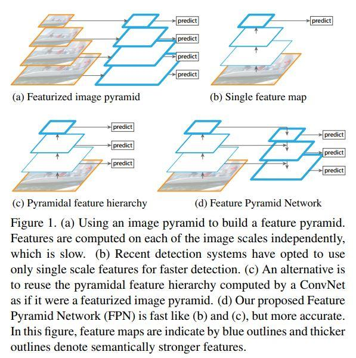
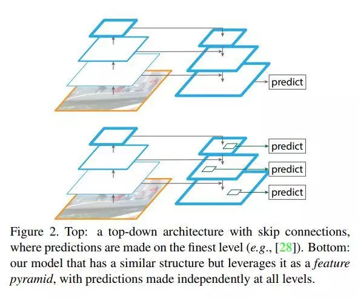
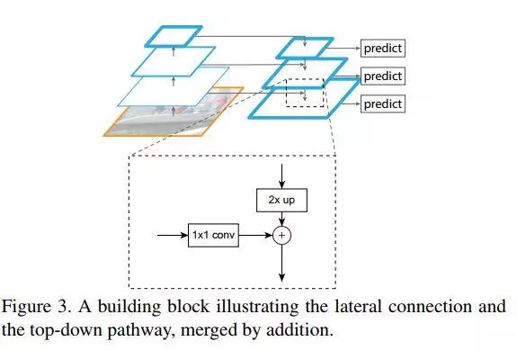

# FPN网络和OHEM

时间：2019/08/05

最近在看的文本检测论文时，总是在论文中看到FPN网络和OHEM，便大概学习了一下。

### 1. FPN网络

文本检测论文中提到这个网络主要是说自己的网络使用与FPN网络相类似的特征融合结构。所以主要学习了FPN网络中的特征融合结构。

论文：[Feature Pyramid Networks for Object Detection](https://arxiv.org/abs/1612.03144)

参考的文章：[FPN: 一种高效的CNN特征提取方法](https://www.jianshu.com/p/5a28ae9b365d) 、[FPN详解](https://blog.csdn.net/WZZ18191171661/article/details/79494534)

#### 1.1 图像金字塔和特征金字塔

在传统的计算机视觉中，经常会碰到图像金字塔。图像金字塔是通过高斯平滑和下采样获得新的图像，也就是说第K层高斯金字塔通过平滑、下采样操作就可以获得K+1层高斯图像，且每次操作后图像尺寸缩小一半。

.jpg)

特征金字塔与图像金字塔类似，只不过它的每一层是从图像上提取的特征。特征金字塔表示了输入图片在不同尺度下的特征，**图像中存在不同尺寸的目标，而不同的目标具有不同的特征，利用浅层的特征就可以将简单的目标的区分开来；利用深层的特征可以将复杂的目标区分开来**。在对于**小目标**的检测中很有用。

#### 1.2 多种金字塔方案

作者总结目前有四种使用特征金字塔的方式。

a) 首先生成图像金字塔，然后对应生成特征金字塔，在每个特征层进行检测。显示，比较耗费计算资源；

b) 对输入图片进行卷积和池化，生成特征金字塔，然后使用最后一层的特征图进行目标检测，主要在RCNN系列网络中使用；缺点就是没有使用到浅层的特征；

c) 在生成的特征金字塔的每一层进行检测，SSD中使用类似的方式；

d) FPN中使用的结构，对特征图进行上采样和融合，再进行目标检测。

#### 1.3 FPN

FPN采用的是下面的结构，不仅在最后一层融合的特征图上进行预测，同时在前面的融合的层也进行预测。

特征融合的具体过程：

#### 1.3.1网络结构

论文中采用ResNet网络，分别选择`conv2、conv3、conv4、conv5`的特征图`C2、C3、C4、C5`作为特征金塔层`P2、P3、P4、P5`。其中`C5`经过`1*1`卷积得到`P5`，对`P5`进行上采样（双线性插值方法）与经过`1*1`卷积的`C4`（使用1*1卷积是为了让两个层的通道数一样）相加，得到整合的特征图，在融合的特征图后面接上3\*3的卷积（为了消除上采样造成的aliasing effect），得到`P4`，剩下的特征金字塔层类似。

在预测时，在所有特征金字塔层上共享分类器/回归器，也就是说只一个分类器，它在所有层上滑动进行预测。所以，在`1*1`卷积时，将输出通道数固定在256。

#### 1.4应用

##### 1.RPN

因为特征图的尺度是不一样的，所以就不需要在一个特征图上设置多个尺度的anchor了，作者分别在${P2、P3、P4、P5、P6}$上的anhcors大小为$32^2,64^2,128^2,256^2,512^2$ ，每个anchor使用三个不同的长宽比$\{1:2, 1:1, 2:1\}$

##### 2.Fast RCNN

对给定了一个候选框，需要从输入图像的特征图中得到候选框对应的特征图，然后利用ROI Pooling层转化成统一大小的特征图，再进行分类和坐标回归。

对于一个候选框，作者从$P_k$层中获取特征图，$k_0=4$：

### 2. OHEM

OHEM（Online Hard Example Mining）指的是在计算损失时不使用全部的负样本，而是选择部分损失较大的负样本参与总损失的计算。这样做可以达到正负样本均衡的问题，而不用对训练集中的样本进行正负样本均衡的处理。

在文本检测中，主要运用在文本/非文本预测的损失计算中。考虑到一张图片中文本区域的面积较小，所以属于文本类的像素较少，而负样本（非文本像素）较多，所以使用OHEM方法只选择损失较大的负样本计算总的损失。