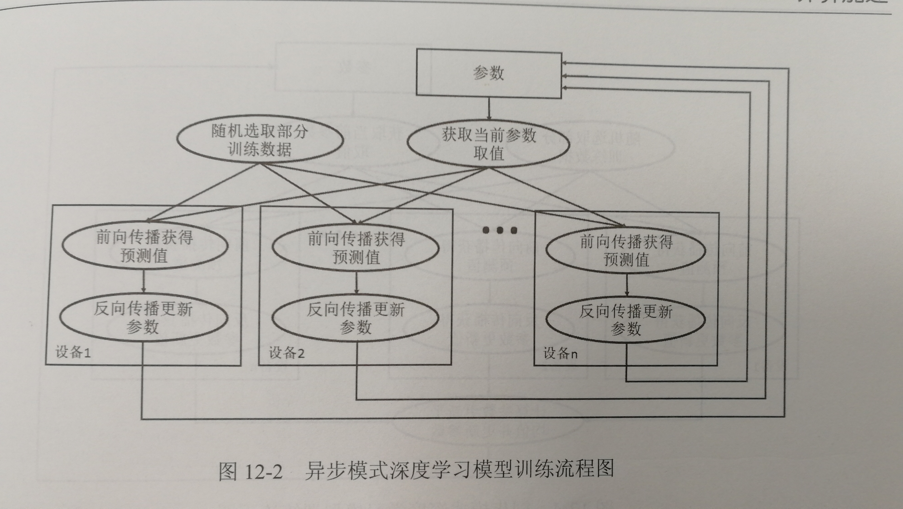
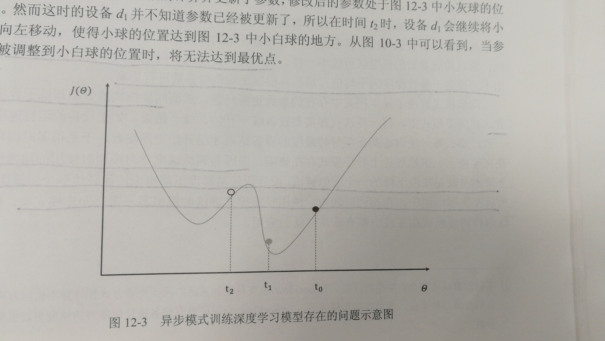
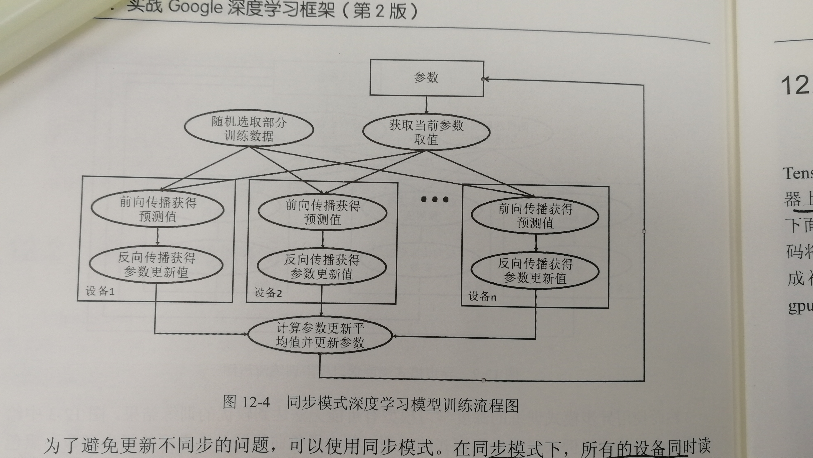

# Tensorflow利用多GPU进行并行训练

「参考：Tensorflow实战Google深度学习框架（第2版）」

在tensorflow中可以很容易的实现单个GPU上进行训练，但有时希望使用多个GPU同时训练，这时需要了解如何并行化的训练深度学习模型。常用的并行化方式有两种：`同步模式`和`异步模式`，两者的区别就在于参数更新的方式不同。

### 1. 异步模式

* 流程

在每一轮的迭代中，不同设备会读取参数的最新值（因为读取时间不同，可能读取的参数不同），然后根据当前的参数和随机抽取的一小部分训练数据，不同设备各自运行反向传播的过程并独立的更新参数。

* 优缺点

  优点：相比于同步模式，每个设备只负责自己的参数更新，不需要等待其他设备，效率较高

  缺点：可能无法达到最优的训练结果
  
  
  
  **解释：**假设两个设备$d_0,d_1$同时在时刻$t_0$读取了最新的参数，两个设备利用反向传播算法计算出的梯度会将黑色小球向左移动。假设在$t_1$时刻，$d_0$完成了反向传播的计算并更新了参数，此时参数在灰色小球处。但由于设备$d_1$并不知道参数已经更新，所有在$t_2$时刻，设备$d_1$会将小球继续向左移动到白色小球位置。这时，参数就无法达到全局的最优点。

### 2. 同步模式

* 流程

在每一轮的迭代中，所有设备同时读取参数的最新值，并随机获取一小部分的训练数据，然后在不同设备上运行反向传播的过程计算梯度（不同设备上虽然参数是一样的，但训练数据不同，所以梯度不同），当所有设备的梯度计算完成后，需要计算不同设备上参数的梯度的平均值，最后利用平均值对参数进行更新。

* 优缺点

  优点：不存在异步模式中参数更新的问题

  缺点：因为不同设备运行速度不一致，所以读取参数值和更新参数时需要等待其他设备，效率较低

虽然理论上异步模式存在缺陷，但因为训练深度模型时使用随机梯度下降本身就是一个近似求解的方法，即使使用梯度下降法也不一定能保证达到全局最优，所以在实际应用中，使用异步方式的模型不一定比同步模式差。因此，两种模式都有广泛的应用。

