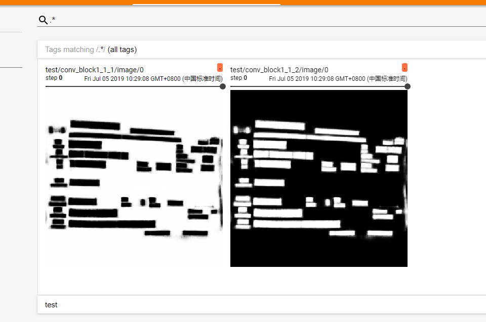
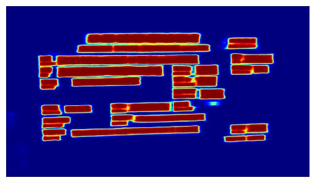

# 深度学习卷积特征图可视化
### 1.Tensorboard绘制
利用Tensorboard记录summary的方式，把特征图保存为图片summary，再利用Tensroboard可视化出来。
缺点：发现可视化出来的结果是黑白的，没有彩色的特征图好看

```python
#把想可视化的张量保存到summary中，张量维度要求4维
tf.summary.image('conv_block1_1_1', self.pixel_cls_scores[:, :, :, 0:1])
tf.summary.image('conv_block1_1_2', self.pixel_cls_scores[:, :, :, 1:])
....
#定义summary writer
summary_writer = tf.summary.FileWriter(tboard_save_dir)
summary_writer.add_graph(sess_pixel_link.graph)

#合并所有的summary
summary_op = tf.summary.merge_all()
#运行summary
merge_summary_value = sess.run([summary_op], feed_dict={img:img})

summary_writer.add_summary(summary=merge_summary_value)
```
利用Tensorboard进行可视化
```bash
tensorboard --logdir=log --port=8000
```



### 2. Matplotlib绘制  

直接`sess.run()`得到需要绘制的特征图，再利用Matplotlib等工具绘制，自由度高，可以绘制成伪彩色的，好看
```python
feature_map= sess_pixel_link.run(
            [feature_map_tensors],
            feed_dict={
                image: img
            })

#绘制特征图，feature_map的大小可以是（height, width, 3）或(height, width)
plt.axis('off')  #不显示坐标轴
plt.imshow(feature_map, cmap = plt.cm.jet)  #以伪彩色的形式绘制，可以自行设置其他方式（坐标之类的可以设置）
plt.savefig(save_dir+'feature_map.jpg',bbox_inches = 'tight')  #保存，去除白边框
```

