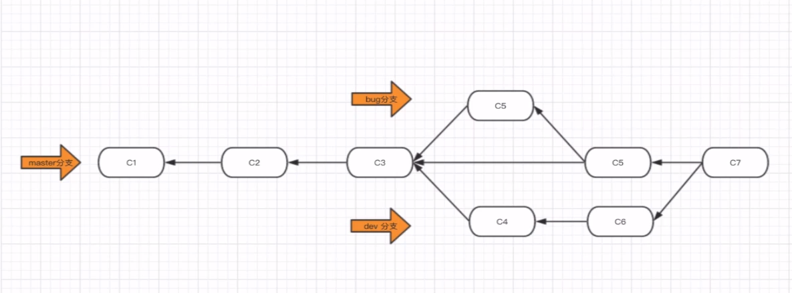

# Git使用

### Git基础

* Git是分布式、版本控制、软件（分布式指的是git在本地和线上仓库都保存，而不是只保存在本地或线上）

* 为什么是做版本控制？

  为了保留之前的版本，方便后续进行回滚和修改

* 直接记录快照，而不是差异比较

  其他版本控制系统大部分以文件变更列表的方式存储信息，也就是说，它们保存一组基本文件，然后在文件发生变化时，保存变化后的文件与基本文件的差异，得到新的版本

  

  而Git则不同，它保存的是数据的快照。可以这样理解：在提交更新时，Git会对当时的全部文件生成一个快照（复制一份），并保存这个快照的索引，通过索引可以快速定位并恢复到到任何版本。对没有修改的文件，只保存一个指向原文件的链接，而不拷贝。

  

* Git保证完整性

  Git中的所有数据在存储前都计算校验和，然后以校验和作为当前版本的引用。校验和是基于Git中文件的内容和目录结构来计算的，所以通过比对检验和和文件内容，可以保证内容和保存时是一样的

  ```
  24b9da6552252987aa493b52f8696cd6d3b00373
  ```

* 三种状态

  在Git中涉及到三种状态：已提交、已修改和已暂存。

  已提交指数据已经保存到本地数据库中了；已修改指的是数据发生了改变，但还没有提交到数据库中；已暂存指的是对某一个修改的文件进行了标记，在下一次提交时保存到数据库中

### 基础操作

为了进行Git操作，首先需要有Git仓库。Git仓库就是一个目录（文件夹），只不过除了原始的项目文件外，里面还有Git保存的一些信息

#### 1.获取Git仓库

* 自己创建（可以对空的或已经存在的项目创建）

  ```bash
  git init
  ```

* 克隆现有的仓库

  ```bash
  git clone https://github.com/libgit2/libgit2
  ```

#### 2.查看当前状态、暂存和提交

* 查看当前状态

  ```bash
  git status
  ```

  可以查看哪些文件没有在跟踪列表中、哪些跟踪列表中的文件已经修改、哪些文件添加到了暂存区中

* 暂存

  `git add`将文件加入到跟踪列表中，并暂存它当前的状态

  添加单个文件

  ```bash
  git add filename
  ```

  添加所有改动

  ```bash
  git add -A
  ```

  添加新文件和编辑过的文件但不包括删除的文件

  ```bash
  git add .
  ```

* 提交

  ```bash
  git commit -m "提交说明"
  ```

  将暂存区的文件提交

#### 3.查看提交历史

```bash
git log
```

#### 4.回滚

* 回滚到之前的版本

    ```
    1.查看版本历史，找到需要回退到的版本的版本号
        git log
    2.回退
        git reset --hard 版本号
    ```

* 回滚到之后的版本

    ```
git reflog
    git reset --hard 版本号
    ```

## 分支

#### 1.分支操作

* 查看所有分支

  ```bash
  git branch
  iss53
  * master
  testing
  ```

  上面一共三个分支，其中*表示当前所处的分支（即HEAD指向的分支）

* 创建分支

  ```bash
  git branch 分支名
  
  创建并切换到分支
  git checkout -b 分支名 
  ```
  
* 切换分支

  ```
git checkout 另一分支名
  ```
  
* 合并分支

  将另一分支合并到当前分支，合并时有可能会发生内容冲突，需要自行决定合并时保留的内容

  ```bash
  git merge 另一分支
  ```

* 删除分支

  ```
  git branch -d 分支名
  ```

#### 2.紧急修复bug



通常开发时，新建一个dev分支进行代码开发，功能开发完成后再合并到master分支。当需要紧急修复线上（master）Bug时，先创建bug分支，切换到bug分支修复bug，然后合并到master分支，再切换到dev分支继续之前的开发

```
假设当前再dev分支开发，需要修复bug
1. git checkout master
2. git branch bug
3. git checkout bug
4. 修复bug，并提交
5. git checkout master
6. git merge bug 合并完后可以删除bug分支
7. git checkout dev
8. 继续开发
```

## 远程仓库

#### 1.Github仓库

* 将本地项目上传到远程github仓库

    ```
    1. github创建仓库，最好与本地同名
    2. 为远程仓库地址取别名
    	git remote add origin 远程仓库url
    3. 推送到远程仓库
    	git push origin 分支
    ```

* clone远程仓库

  ```
  1. 克隆远程仓库到本地（克隆后看不见其他分支，但都克隆下来了，可以直接切换）
  	git clone 远程仓库url
  ```

* 查看远程仓库

  查看本地仓库配置了哪些远程仓库

  ```bash
  git remote //只显示远程仓库名
  git remote -v //显示远程仓库名和url
  ```


* 更新代码

  ```
  git pull origin dev
  等价于
  git fetch origin dev
  git merge dev
  ```

  