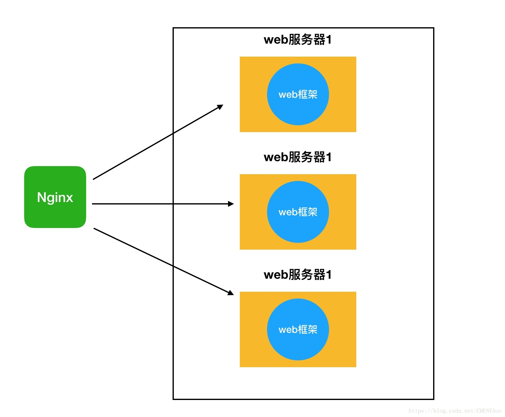
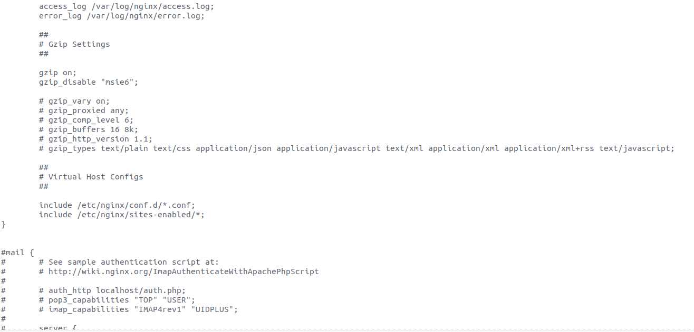

# Nginx + uwsgi + Flask搭建深度学习服务端

## 1. 基础知识

### 1.1 基本概念

uwsgi和nginx的介绍和相互间的关系参考：[浅谈uWSGI和Nginx](https://blog.csdn.net/shu_8708/article/details/79068581)  [uwsgi、wsgi和nginx的区别和关系](https://blog.csdn.net/CHENYAoo/article/details/83055108)

* **web服务器**即用来接受客户端请求，建立连接，转发响应的程序。至于转发的内容是什么，交由**web框架**来处理，即处理这些业务逻辑，如查询数据库、生成实时信息等。Nginx就是一个web服务器，Django或Flask就是**web框架**。

* Uwsgi 则是实现了**WSGI协议**的一个**web服务器**

* Nginx是一个代理服务器。一旦访问量过大，客户端请求连接就要进行长时间的等待。这个时候就出来了分布式服务器，我们可以多来几台web服务器，都能处理请求。但是谁来分配客户端的请求连接和web服务器呢？Nginx就是这样一个管家的存在，由它来分配。



### 1.2 常用操作

* 查看端口监听

  在服务器开启程序后，经常需要查看程序是否监听端口或者监听的端口是否正确

  `netstat -ntlp`

  `lsof -i:端口号` 查看指定端口，例查看8100端口的使用情况：`lsof -i:8100`

* 测试

  在开启服务后，需要测试网络、端口、程序是否正常运行，可以使用以下的工具或命令

  #### Telnet

  如果服务器是在阿里云或者其他云平台，通常在云平台配置完成后，都会使用Telnet工具来测试云平台和本机的网络和端口之间是否连通。

  安装：`sudo apt-get install telnetd`

  使用：`telnet IP 端口号`

  连接是通时输出如下：

  ```shell
  (base) laifeng@laifeng-X6:~$ telnet 101.12.12.84 8000
  Trying 101.12.12.84...
  Connected to 106.15.182.84.
  Escape character is '^]'.
  ^CConnection closed by foreign host.
  ```

  #### Curl

  ubuntu系统自带工具

  使用：`curl URL` 

  ```shell
  (base) laifeng@laifeng-X6:~$ curl 127.0.0.1:8000/
  curl: (7) Failed to connect to 127.0.0.1 port 8000: 拒绝连接
  ```

  #### Postman

  可以配置请求的方式、参数、文件等 

  #### Jmeter

  支持并发测试，主要用来测试并发


## 2.Flask

Flask是python语言的一个**web框架**，用来编写web应该程序。官方网址: [Flask中文官网](http://docs.jinkan.org/docs/flask/index.html)

基本使用参考官网教程

```python
from flask import Flask
app = Flask(__name__)

@app.route('/')
def hello_world():
    return 'Hello World!'

if __name__ == '__main__':
    app.run()
```

在终端运行程序：

```shell
$ python hello.py
 * Running on http://127.0.0.1:5000/
```

## 3. uwsgi

官网：[uwsgi](https://uwsgi-docs.readthedocs.io/en/latest/)

### 3.1 uwsgi启动Flask程序

* 方法一：直接启动

  `uwsgi --socket 127.0.0.1:3031 --wsgi-file myflaskapp.py --callable app --processes 4 --threads 2 --stats 127.0.0.1:9191`

  后面有相应的参数说明

* 方法二：uwsgi配置文件启动

  直接启动时需要在终端设置各个参数，比较麻烦，通常可以编写一个uwsgi的配置文件，在运行uwsgi时传入配置文件来达到相同的启动效果。

  **uwsgi配置文件 **

  ```shell
  # my_uwsgi.ini
  [uwsgi]               #固定开头   
  #http = 127.0.0.1:6666    #使用http协议 监听6666端口
  socket = 127.0.0.1:6666   #使用wsgi协议 使用ngix时最好使用socket
  wsgi-file = test_flask.py #web应用程序文件
  callable = app            #调用的接口，flask程序为app
  buffer-size = 65536       #设置最大允许的请求大小 
  master = true             #启用主进程
  lazy = true               #启用延迟加载 设置多进程时，默认是主进程加载app（即主程序 import类的代码，再启动子进程，子进程不加载；启用后，先启动子进程，然后在每个子进程中加载app
  workers = 3               #设置进程个数
  threads = 1               #设置线程个数
  ```

  运行`uwsgi --ini my_uwsgi.ini`，启动服务

## 4. nginx

* 安装：

  `sudo apt-get install nginx`

  验证：输入`nginx`启动默认的程序，使用浏览器访问 IP_address:80，出现如下结果即安装完成

  

* 使用：

  ```shell
  nginx 或 nginx -c /path/to/nginx.conf 启动
  nginx -s reload   修改配置后重新加载生效
  nginx -s stop     快速停止nginx
  nginx -s quit     正常停止nginx
  ```

* nginx配置

  nginx在使用前需要进行相关的配置，设置文件目录：`/etc/nginx/nginx.conf /etc/nginx/sites-enabled/和/etc/nginx/sites-avilable/`下，其中`nginx.conf`会包含(include)其他两个目录下的设置，所以也可以直接在`nginx.conf`中设置。

  这里采用的方式是在`sites-enabled`目录下编写服务设置，并在`nginx.conf`中包含。

  * 第一步

    在`sites-enabled`目录下创建配置文件`my_server.conf`，在文件中写入：

    ```nginx
    server{
       listen 8100;                #nginx监听端口,即前端访问的端口
       server_name localhost;      
       location /v1/parse {        #配置路由
           include uwsgi_params; #导入uwsgi配置
           uwsgi_pass 127.0.0.1:6666;        #转发到6666端口，所以uwsgi需要监听这个端口
        }
    }
    ```

    

  * 第二步

    在nginx.conf中包含配置文件 



    注释这两行：
    
    ```nginx
    include /etc/nginx/conf.d/*.conf;
  include /etc/nginx/sites-enabled/*;
    ```

    添加`include /etc/nginx/sites-enabled/ocr_socket;`
    
    最后的代码如下：
    
    ```nginx
    #include /etc/nginx/conf.d/*.conf;
    #include /etc/nginx/sites-enabled/*;
    include /etc/nginx/sites-enabled/ocr_socket;
    ```

* 负载均衡

  参考：[nginx 配置 uwsgi 负载均衡](https://blog.csdn.net/haeasringnar/article/details/82936887)

  如果想要通过nginx给多个uwsgi服务代理，同时这个几个uwsgi服务是相同的服务只是不同进程（比如同时开了两个uwsgi服务，程序一样，分别监听不同端口），就需要进行负载均衡处理。如果不使用负载均衡，请求一直转发到同一个端口，达不到实现多个进程同时处理的效果。

  参考：[nginx 配置 uwsgi 负载均衡](https://blog.csdn.net/haeasringnar/article/details/82936887)
  
  这里直接复制参考中的例子：
  
  ```nginx
  # 没有使用负载均衡
  server {                                                                        
      listen 9000;
      add_header Access-Control-Allow-Origin *;
      add_header Access-Control-Allow-Headers Authorization,Origin,X-Requested-With,Content-Type,Accept;
      #add_header Access-Control-Allow-Methods POST,GET,PATCH,PUT,DELETE,OPTIONS,VIEW;
      add_header Access-Control-Allow-Methods POST,GET,PATCH,PUT,DELETE;
      add_header Access-Control-Allow-Credentials true;
      client_max_body_size 100m;
   
      location  / {
          proxy_pass http://127.0.0.1:8000;
          proxy_set_header Host $host;
          proxy_set_header X-Real-IP $remote_addr;
          proxy_set_header X-Forwarded-For $proxy_add_x_forwarded_for;
          proxy_set_header X-Forwarded-Protocol $scheme;
      }
     
  }  
  
  # 使用普通的 http 链接
  upstream test01 {
      server 127.0.0.1:8001;
      server 127.0.0.1:8002;
  }  
  server {
      listen 9001;          
      add_header Access-Control-Allow-Origin *;
      add_header Access-Control-Allow-Headers Authorization,Origin,X-Requested-With,Content-Type,Accept;
      #add_header Access-Control-Allow-Methods POST,GET,PATCH,PUT,DELETE,OPTIONS,VIEW;
      add_header Access-Control-Allow-Methods POST,GET,PATCH,PUT,DELETE;
      add_header Access-Control-Allow-Credentials true;
      client_max_body_size 100m;
       
      location  / {         
          proxy_pass http://test01;
      }   
  }
  # 如果使用的是 uwsgi
  upstream mycom{
      ip_hash;
      server 127.0.0.1:8003;  #负载均衡服务器群
      server 127.0.0.1:8004;
  }
  
  server {
      listen 9002;
      # 表示最大允许的body体大小
      client_max_body_size 100m;
       
      location  / {         
          include uwsgi_params;
      	uwsgi_pass mycom; #连接上面配置的负载均衡
      }   
  }
  ```
  
  在**使用负载均衡**时，默认情况下，负载均衡采用的方式是**轮询**。每个请求按时间顺序逐一分配到不同的后端服务器，如果后端服务器down掉，能自动剔除。
  
  ```nginx
  upstream backserver { 
  server 192.168.0.14; 
  server 192.168.0.15; 
  } 
  ```
  
  在本次布署时采用方式的是**指定权重的轮询**（其实应该使用默认就可以的）。指定轮询几率，weight和访问比率成正比，用于后端服务器性能不均的情况。
  
  ```nginx
  upstream backserver { 
  server 192.168.0.14 weight=10; 
  server 192.168.0.15 weight=10; 
  } 
  ```
  
  ## 5. 布署并发式深度学习任务 
  
  因为深度学习算法需要依赖大量的cpu和gpu计算，如果想要扩大深度学习算法服务端的并发量，根据网上的资料，通常有两种方法：增加进程数量和使用batch进行推断。
  
  ### 5.1 增加进程数量
  
  增加进程的数量其实就是相当于同时启动了多个一样的程序，所以当启动2个进程时，如果同时有2个请求，那么服务器可以同时处理这2个请求，而不需要排队等待，即并发量为2。理论上开启多个进程即可使并发量增大。
  
  优点：布署简单，对于任务中有多个模型也适用
  
  缺点：每一个进程都需要分配一定资源，对硬件要求高（需要考虑cpu数量以及服务器的显存大小）。同时当多个进程同时运行时，会比仅单个进程耗费更多的时间
  
  #### 布署方法 
  
  利用Flask框架自身就能实现多进程，或者采用uwsgi启动多个flask进程方法也是可以。
  
  参考3.1小节的配置文件，主要设置workers数量和延迟加载
  
  ```shell
  master = true             #启用主进程
  lazy = true               #启用延迟加载 设置多进程时，默认是主进程加载app（即主程序 import类的代码，再启动子进程，子进程不加载；启用后，先启动子进程，然后在每个子进程中加载app
  workers = 3               #设置进程个数
  threads = 1               #设置线程个数
  ```
  
  在进行项目的过程中发现，因为每个进程需要消耗4G的gpu显存，而总显存只有16G，一张显卡上只能勉强放上4个进程。这时采用了每个显卡上分别放置不同的uwsgi程序的方法。即分别在0 1号卡启动一个uwsgi程序，每个程序使用4个进程，分别监听不同的端口，然后再使用nginx来转发请求，同时对nginx使用负载均衡策略来保证同一时刻的请求尽可能分散到各个uwsgi监听的端口。
  
  ### 5.2 使用batch进行推断
  
  这种方法较上一种方法稍微复杂一点，同时按我个人的理解这种方法更加适用于布署的深度学习任务中仅使用一个模型（或者说端到端的模型）时，因为这种情况下才比较容易把图片整合成一个batch后再对batch进行推断，当一个任务用到多个模型时，每个模型之间难免会存在不能／不易于使用batch操作的情况。
  
  目前的项目没有采用这种并发的方式，可以参考：[教程 | 如何使用Keras、Redis、Flask和Apache把深度学习模型部署到生产环境？](https://mp.weixin.qq.com/s/Zo1iBzAY1dBAa2pRTf-BbA?)
  
  
  
  

