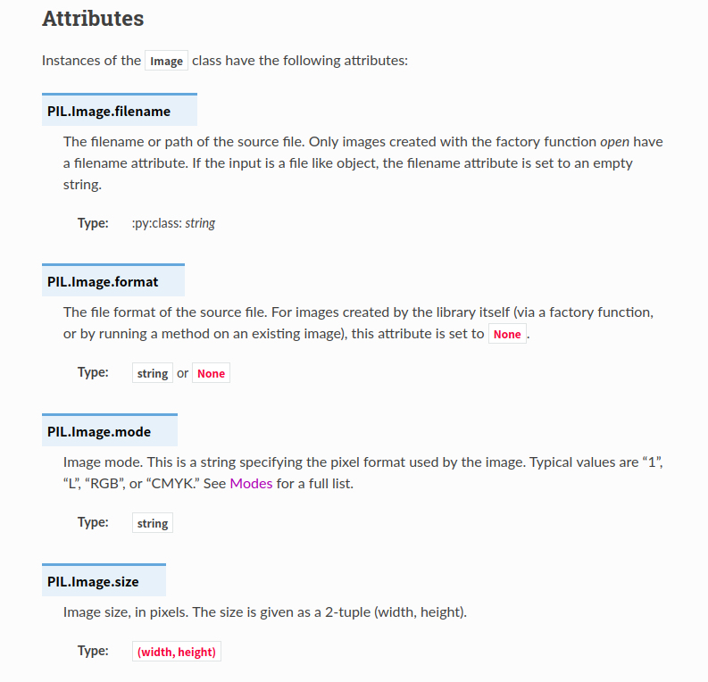
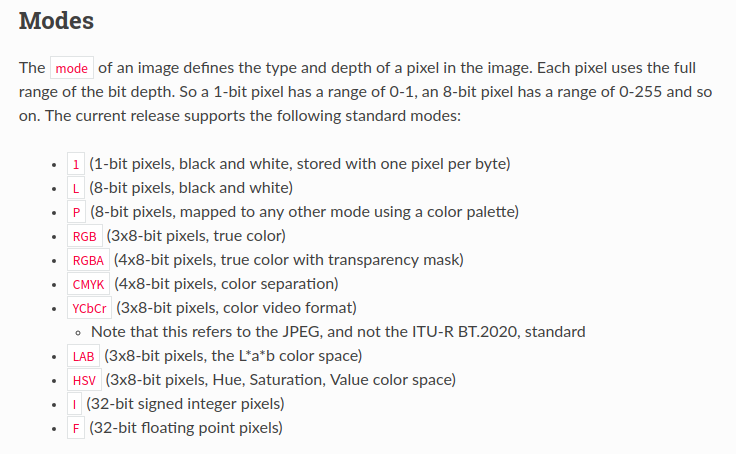
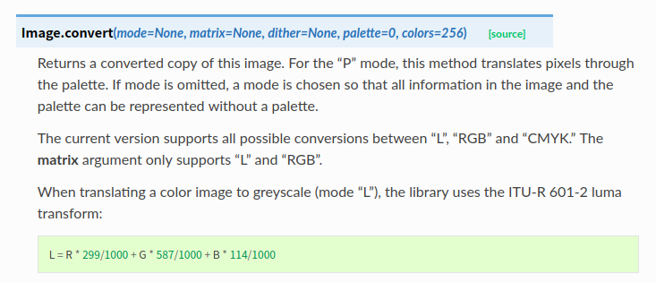
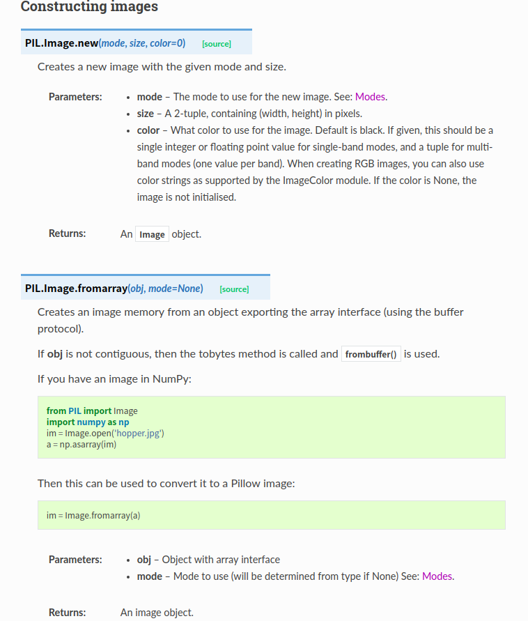
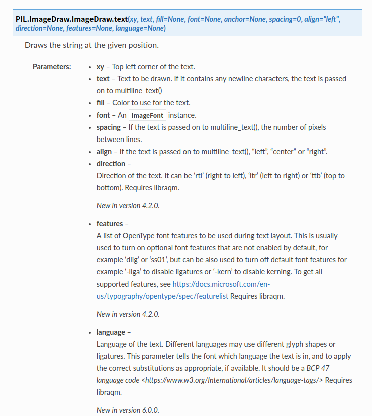

# Python 图像处理

主要使用Pillow和Python opencv两个模块，主要操作包括的：图片读入、显示、保存（按不同质量），绘制（空白图、线、矩形），类型转换等。另外，记录Opencv中的基本图像处理方法，以及两种模块之间的转换。

### 1. Pillow

文档：[Pillow](https://pillow.readthedocs.io/en/stable/index.html)

#### 2.1 读入、显示、保存

```python
from PIL import Image
im = Image.open("bride.jpg")
im.show()
#保存
im.save('new_birde.jpg')

#设置保存图片的质量
img.save('new_birde.jpg',  quality=95)
```

#### 2.2 图片属性



```python
w, h = img.size
img_resized = img.resize((w/2, h/2))
```

#### 2.3 彩色图转换成黑白图

PIL支持的`mode`





```python
img = Image.open('bird.jpg')
img.convert('L')
```

#### 2.4 创建新图



```python
from PIL import Image
import numpy as np

# Image.new()
new_img = Image.new("RGB", (100,100), color=(255, 255, 255))

# Image.fromarray()
im = Image.open('hopper.jpg')
a = np.asarray(im)

im = Image.fromarray(a)
```

#### 2.5 绘制

```python
from PIL import Image, ImageDraw

im = Image.open("hopper.jpg")

draw = ImageDraw.Draw(im)

#绘制线
draw.line((0, 0) + im.size, fill=128, width=2)
draw.line((0, im.size[1], im.size[0], 0), fill=128)

#绘制矩形
draw.rectangle([(x0, y0),(x1, y1)], outline=(255,0,0), width=3) 
draw.rectangle([x0, y0,x1, y1], fill=(255,0,0), width=3) 

#绘制文字
draw.text((x, y), text) #（x,y)为txt左上角坐标
```

* 绘制文字



* 设置文字字体

  ```python
  from PIL import ImageFont, ImageDraw
  
  draw = ImageDraw.Draw(image)
  
  # use a bitmap font
  font = ImageFont.load("arial.pil")
  
  draw.text((10, 10), "hello", font=font)
  
  # use a truetype font(矢量文字字体)
  font = ImageFont.truetype("arial.ttf", 15)
  
  draw.text((10, 25), "world", font=font)
  ```

### 2. Opencv

2.1 读入、显示、保存

2.2 绘制

2.3 彩色图与黑白图转换

2.4 boundingRect、minAreaRect、minEnclosingCircle

主要参考[OpenCV 学习笔记03](https://www.cnblogs.com/gengyi/p/10317664.html))

### 3. 转换

3.1 PIL转化成Numpy(Opencv)

3.2 Opencv转化成PIL