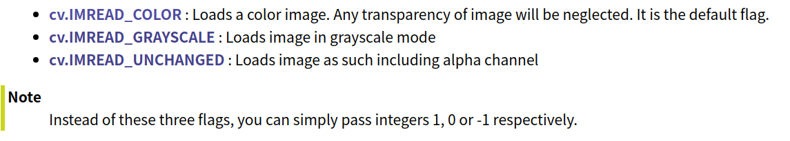
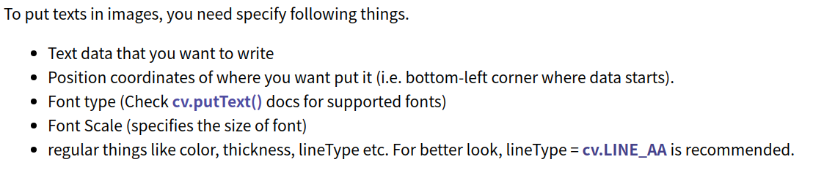

# Python 图像处理

主要使用Pillow和Python opencv两个模块，主要操作包括的：图片读入、显示、保存（按不同质量），绘制（空白图、线、矩形），类型转换等。另外，记录Opencv中的基本图像处理方法，以及两种模块之间的转换。

### 1. Pillow

文档：[Pillow](https://pillow.readthedocs.io/en/stable/index.html)

#### 2.1 读入、显示、保存

```python
from PIL import Image
im = Image.open("bride.jpg")
im.show()
#保存
im.save('new_birde.jpg')

#设置保存图片的质量
img.save('new_birde.jpg',  quality=95)
```

#### 2.2 图片属性


```python
w, h = img.size
img_resized = img.resize((w/2, h/2))
```

#### 2.3 彩色图转换成黑白图

PIL支持的`mode`


```python
img = Image.open('bird.jpg')
img = img.convert('L')
```

#### 2.4 创建新图


```python
from PIL import Image
import numpy as np

# Image.new()
new_img = Image.new("RGB", (100,100), color=(255, 255, 255))

# Image.fromarray()
im = Image.open('hopper.jpg')
a = np.asarray(im)

im = Image.fromarray(a)
```

#### 2.5 绘制

```python
from PIL import Image, ImageDraw

im = Image.open("hopper.jpg")

draw = ImageDraw.Draw(im)

#绘制线
draw.line((0, 0) + im.size, fill=128, width=2)
draw.line((0, im.size[1], im.size[0], 0), fill=128)

#绘制矩形
draw.rectangle([(x0, y0),(x1, y1)], outline=(255,0,0), width=3) 
draw.rectangle([x0, y0,x1, y1], fill=(255,0,0), width=3) 

#绘制文字
draw.text((x, y), text) #（x,y)为txt左上角坐标
```

* 绘制文字


* 设置文字字体

  ```python
  from PIL import ImageFont, ImageDraw
  
  draw = ImageDraw.Draw(image)
  
  # use a bitmap font
  font = ImageFont.load("arial.pil")
  
  draw.text((10, 10), "hello", font=font)
  
  # use a truetype font(矢量文字字体)
  font = ImageFont.truetype("arial.ttf", 15)
  
  draw.text((10, 25), "world", font=font)
  ```

### 2. Opencv

#### 2.1 读入、显示、保存

* 读入

  `cv2.imread()`：第二个参数为读入图片的方式

  

  ```python
  import cv2
  #读入
  img= cv2.imread('mess.jpg', 0)
  #显示
  cv.namedWindow('image', cv.WINDOW_NORMAL)  #默认cv.WINDOW_AUTOSIZE表示原图大小显示；cv.WINDOW_NORMAL表示可以设置窗口大小
  cv.imshow('image',img)
  cv.waitKey(0)
  #保存
  cv.imwrite('messigray.png',img)
  ```

* 设置保存质量

  cv2.imwrite(存储路径，图像变量, [存盘标识])

  存盘标识：

  1. cv2.CV_IMWRITE_JPEG_QUALITY  设置图片格式为.jpeg或者.jpg的图片质量，其值为0---100（数值越大质量越高），默认95
  2. cv2.CV_IMWRITE_WEBP_QUALITY  设置图片的格式为.webp格式的图片质量，值为0--100
  3. cv2.CV_IMWRITE_PNG_COMPRESSION  设置.png格式的压缩比，其值为0--9（数值越大，压缩比越大），默认为3

  ```python
  cv2.imwrite('test.jpg',img,[int(cv2.IMWRITE_JPEG_QUALITY),70])
  ```

#### 2.2 绘制

注意：`thickness`设置为-1表示填充；坐标表示：(x1, y1)(x2, y2)为左上角和右下角

```python
import numpy as np
import cv2 as cv
# Create a black image
img = np.zeros((512,512,3), np.uint8)
#绘制线
# Draw a diagonal blue line with thickness of 5 px
cv.line(img,(0,0),(511,511),(255,0,0),5)
#绘制矩形
cv.rectangle(img,(384,0),(510,128),(0,255,0),3)
#绘制多边形
pts = np.array([[10,5],[20,30],[70,20],[50,10]], np.int32)
pts = pts.reshape((-1,1,2))
cv.polylines(img,[pts],True,(0,255,255))
```



```python
font = cv.FONT_HERSHEY_SIMPLEX
cv.putText(img,'OpenCV',(10,500), font, 4,(255,255,255),2,cv.LINE_AA)
```

#### 2.3 彩色图与黑白图转换

使用`cv2.cvtColor()`

2.3.1通道转换

flag为`cv2.COLOR_BGR2RGB`

```python
img=cv2.cvtColor(img, cv2.COLOR_BGR2RGB) # cv2默认为bgr顺序
```

2.3.2颜色转换

常见的转换主要有两种：`BGR->Gray`和`BGR->HSV`，对应的flag分别为`cv2.COLOR_BGR2GRAY``cv2.COLOR_BGR2HSV`

```python
import cv2
img = cv2.imread('./example.jpg')
gray = cv2.cvtColor(img, cv2.COLOR_BGR2GRAY)

cv2.imwrite('./result2.jpg', gray)
```

#### 2.4 boundingRect、minAreaRect、minEnclosingCircle

主要参考[OpenCV 学习笔记03](https://www.cnblogs.com/gengyi/p/10317664.html)


### 3. 转换

3.1 PIL转化成Numpy(Opencv)

```python
img = numpy.array(im) #im是PIL.Image类型
```

3.2 Opencv转化成PIL

```python
img = Image.fromarray(img.astype('uint8')).convert('RGB')
```

