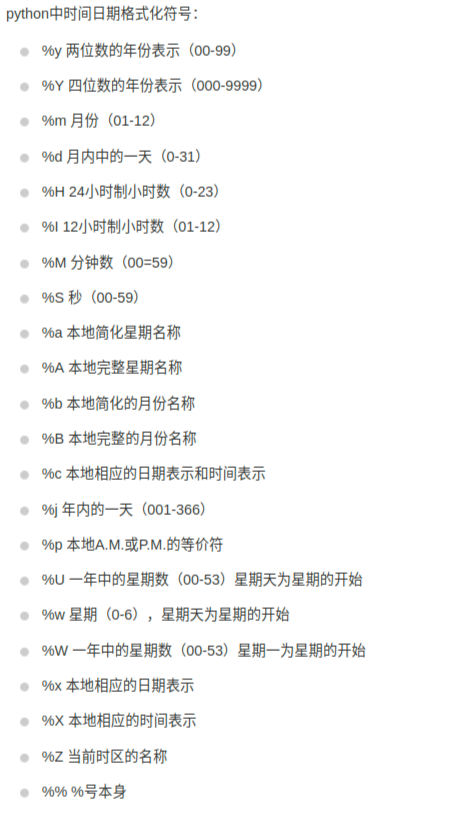

# python格式化输出时间

主要使用`time`和`datetime`两个内置模块

###  1. time

```python
import time
print(time.strftime('%Y-%m-%d %H:%M:%S',time.localtime()))

2019-01-24 20:23:51
```

**time.strftime参数说明：**



### 2. datetime

[datetime— Basic date and time types](https://docs.python.org/3/library/datetime.html#strftime-and-strptime-behavior)

```python
from datetime import datetime
s1 = datetime.now().strftime('%Y-%m-%d %H:%M:%S')
s2 = datetime.now().strftime('%Y-%m-%d %H:%M:%S:%f') #毫秒
```

**%f代表毫秒**