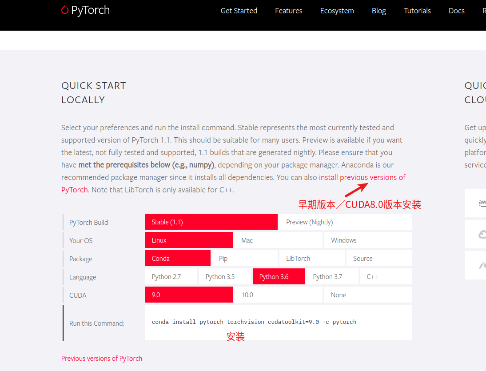

# pytorch-warpctc安装
参考了：[linux+anaconda3+pytorch+warp-ctc环境配置](https://blog.csdn.net/Before_sunshine/article/details/85677675)、[Pytorch编译安装warp-CTC](https://blog.csdn.net/zzc15806/article/details/83999668)
实验了多次，在`pytorch=1.1.0`、`torchvision=0.3.0`情况下安装成功，在`pytorch=1.0.1`版本下安装报错
安装pytorch
pytorch安装参考官网安装方法：[Pytorch](https://pytorch.org/)



```shell
#cuda 8.0
pip install torch==1.1.0 -f https://download.pytorch.org/whl/cu80/stable # CUDA 8.0 build
```
安装torchvision
```shell
pip install torchvision #自动安装torchvision，并且pytorch版本不匹配时，自动安装新版本的pytorch
```
安装warpctc-pytorch
```shell
git clone https://github.com/SeanNaren/warp-ctc.git #https://github.com/baidu-research/warp-ctc.git是旧的github源
cd warp-ctc
mkdir build
cd build
cmake ..
make
cd ../pytorch_binding
python setup.py install
```
验证是否安装成功：
```python
#退出warp-ctc文件夹，进入python
>>> import torch
>>> from warpctc_pytorch import CTCLoss #不报错即成功
```

