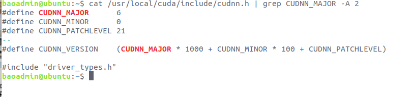

# Ubuntu16.04安装CUDA和cudnn

前提：系统已经安装了显卡驱动，且显卡驱动版本满足CUDA版本要求

查看显卡驱动版本与CUDA和cudnn之间的对应关系：[CUDA，NVIDIA Driver，Linux，GCC之间的版本对应关系表格](https://blog.csdn.net/dudu815110/article/details/87167518)

CUDA版本与Tensorflow版本对应关系：[CUDA_Tensorflow版本](https://www.tensorflow.org/install/source)（最后）

安装教程参考：[Ubuntu16.04下安装cuda和cudnn的三种方法（亲测全部有效）](https://blog.csdn.net/wanzhen4330/article/details/81699769)

### 1.安装CUDA

**（1）下载安装文件**。英伟达官网下载[cuda安装包](https://developer.nvidia.com/cuda-toolkit-archive)：https://developer.nvidia.com/cuda-toolkit-archive 

选择下载runfile（后缀为.run）文件来安装。

（2）安装

```shell
sudo bash cuda_8.0.61_375.26_linux.run
```

依次选择accept、n(不安装驱动)、y、y、y，完成安装。

（3）设置环境变量

打开主目录下的 .bashrc文件添加如下路径：

```shell
export LD_LIBRARY_PATH=$LD_LIBRARY_PATH:/usr/local/cuda-8.0/lib64
export PATH=$PATH:/usr/local/cuda-8.0/bin
export CUDA_HOME=$CUDA_HOME:/usr/local/cuda-8.0
```

（4）测试


### 2.安装cudnn

（1）下载安装文件

按需求下载[cudnn的安装文件：https://developer.nvidia.com/rdp/cudnn-archive](https://developer.nvidia.com/rdp/cudnn-archive)

（2）安装cudnn

```shell
#解压cudnn文件
tar -zxcf cudnn-8.0-linux-x64-v6.0.tgz
sudo cp cuda/include/cudnn.h /usr/local/cuda/include/
sudo cp cuda/lib64/libcudnn* /usr/local/cuda/lib64/
sudo chmod a+r /usr/local/cuda/include/cudnn.h
sudo chmod a+r /usr/local/cuda/lib64/libcudnn*
```

（3）测试安装是否成功（查看版本）

```shell
cat /usr/local/cuda/include/cudnn.h | grep CUDNN_MAJOR -A 2
```

出现如下结果，则安装成功：



​	