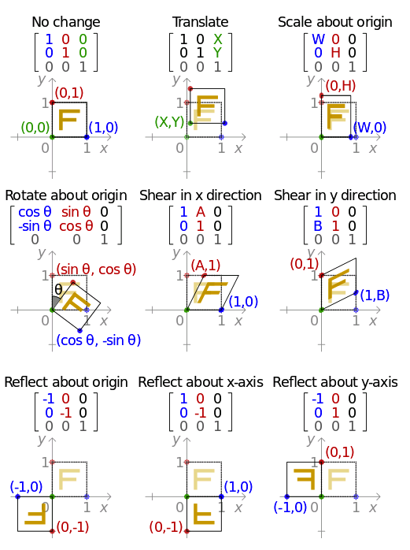

# 仿射变换与透视变换

仿射变换和透视变换都可以表达成一个变换矩阵$M$，利用$M$可以计算原点$(x,y)$变换后的位置$(x',y')$

对于仿射变换：
$$
\left[ \begin{matrix} x' & y' & 1 \end{matrix} \right]^T = \left[ \begin{matrix} a_{11} & a_{12} & t_x \\ a_{21} & a_{22} & t_y \\ 0 & 0 & 1 \end{matrix} \right] *\left[ \begin{matrix} x' & y' & 1 \end{matrix} \right]^T
$$
其中，$t_x,t_y$表示平移

也可以写成：
$$
\left[ \begin{matrix} x' & y' & 1 \end{matrix} \right] = \left[ \begin{matrix} x' & y' & 1 \end{matrix} \right] *\left[ \begin{matrix} a_{11} & a_{12} & t_x \\ a_{21} & a_{22} & t_y \\ 0 & 0 & 1 \end{matrix} \right]^T
$$
对于透视变换：
$$
\left[ \begin{matrix} x' & y' & 1 \end{matrix} \right]^T = \left[ \begin{matrix} a_{11} & a_{12} & t_x \\ a_{21} & a_{22} & t_y \\ a_{31} & a_{32} & a_{33} \end{matrix} \right] *\left[ \begin{matrix} x' & y' & 1 \end{matrix} \right]^T
$$


常见的仿射变换：



```python
# 随机旋转
def random_rotate(img, mask, angle, fit_output=False):
    """random rotate img and mask around center point 
    :param img   : input img, <numpy.ndarray>
    :param mask  : mask img, <numpy.ndarray>
    :param angle : random rotate angle
    :param fit_output : if True, output img is expand to cover complete img
    """
    r = random.randint(-angle, angle)
    h, w = img.shape[:2]
    # M <numpy.ndarray(2,3)>
    M = cv2.getRotationMatrix2D((int(w/2), int(h/2)), r, 1)

    out_h = h
    out_w = w
    if fit_output:
        # point (x, y) x是横坐标，y是纵坐标
        warped_points = trans_points(M, np.array([[0, 0], [w-1, 0], [w-1, h-1], [0, h-1]]))
        x_min = warped_points[:, 0].min()
        x_max = warped_points[:, 0].max()
        y_min = warped_points[:, 1].min()
        y_max = warped_points[:, 1].max()

        out_h = int(y_max - y_min)
        out_w = int(x_max - x_min)
        M[0, 2] -= x_min
        M[1, 2] -= y_min
    
    rotated_img = cv2.warpAffine(img, M, (out_w, out_h))
    rotated_mask = cv2.warpAffine(mask, M, (out_w, out_h))

    return rotated_img, rotated_mask

# 随机透视变换
def random_perspective(img, mask, rate, fit_output=False):
    """do random perspective transform
    :param img   : input img, <numpy.ndarray>
    :param mask  : mask img, <numpy.ndarray>
    :param rate  : 
    :param fit_output : if True, output img is expand to cover complete img
    """
    h, w = img.shape[:2]
    dx = np.array([random.uniform(-rate, rate) * w for i in range(4)], dtype=np.float32)
    dy = np.array([random.uniform(-rate, rate) * h for i in range(4)], dtype=np.float32)
    d = np.stack((dx, dy), axis=1)

    ori_points = np.array([[0, 0], [w-1, 0], [w-1, h-1], [0, h-1]], dtype=np.float32)
    target_points = ori_points + d

    out_h = h
    out_w = w
    if fit_output:
        x_min = target_points[:, 0].min()
        x_max = target_points[:, 0].max()
        y_min = target_points[:, 1].min()
        y_max = target_points[:, 1].max()

        out_h = int(y_max - y_min)
        out_w = int(x_max - x_min)
        target_points[:, 0] -= x_min
        target_points[:, 1] -= y_min

    
    M = cv2.getPerspectiveTransform(ori_points, target_points)
    warped_img = cv2.warpPerspective(img, M, (out_w, out_h))
    warped_mask = cv2.warpPerspective(mask, M, (out_w, out_h))

    return warped_img, warped_mask
    
def trans_points(M, points):
    """calculate transformed points with M, fit to affine transform and perspective transform
    :param M : transfrom matrix <numpy.ndarray(2, 3)> or <numpy.ndarray(3,3)>
    :param points : points need to be transformed <numpy.ndarray(N, 2)>
    """
    if M.shape[0] == 2:
        M = np.concatenate([M, np.array([[0, 0, 1]])])

    padded = np.concatenate((points, np.ones([points.shape[0], 1])), axis=1)
    
    for i in range(padded.shape[0]):
        padded[i] = np.dot(M, padded[i])

    out = padded[:, :2] / padded[:, 2:]
    return out
```

