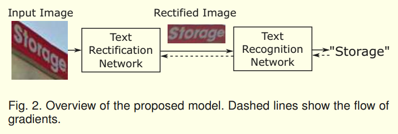
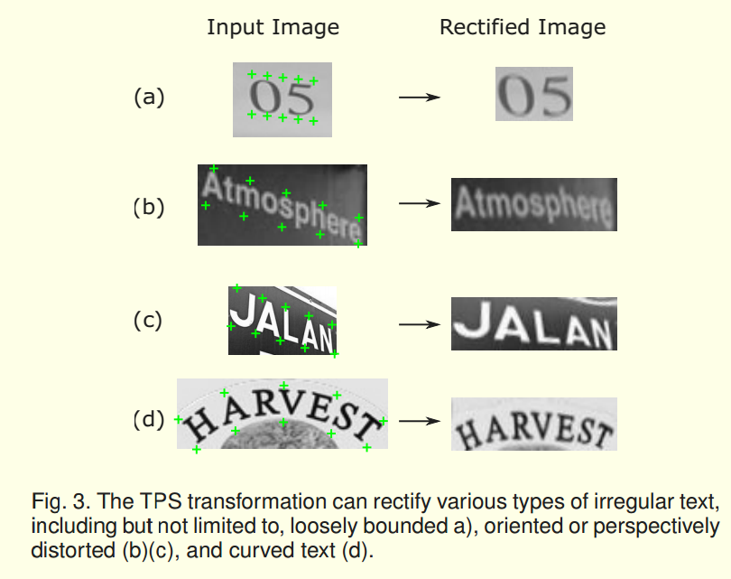
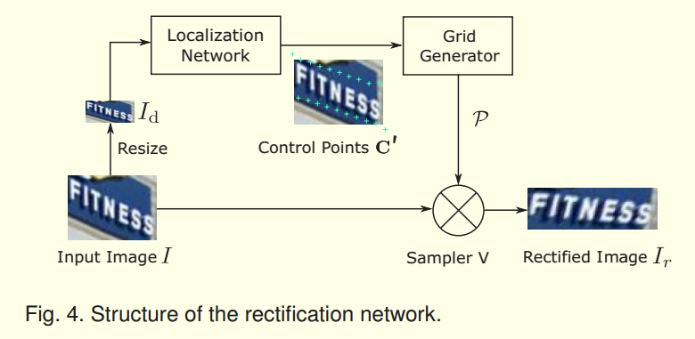
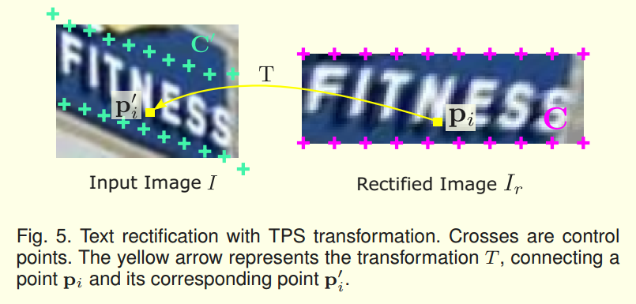

> *论文：**Aster: An Attentional Scene Text Recognizer with Flexible Rectification
>
> 发表期刊：PAMI
>
> 发表时间：2018
>
> 编辑时间：2019.4.8

> Abstract—A challenging aspect of scene text recognition is to handle text with distortions or irregular layout. In particular, perspective text and curved text are common in natural scenes and are difficult to recognize. In this work, we introduce ASTER, an end-to-end neural network model that comprises a rectification network and a recognition network. The rectification network adaptively transforms an input image into a new one, rectifying the text in it. It is powered by a flexible Thin-Plate Spline transformation which handles a variety of text irregularities and is trained without human annotations. The recognition network is an attentional sequence-to-sequence model that predicts a character sequence directly from the rectified image. The whole model is trained end to end, requiring only
> images and their groundtruth text. Through extensive experiments, we verify the effectiveness of the rectification and demonstrate the state-of-the-art recognition performance of ASTER. Furthermore, we demonstrate that ASTER is a powerful component in end-to-end recognition systems, for its ability to enhance the detector.

场景文字识别中一个主要的挑战是处理变形的文本和不规则布局，特别是透视文本和弯曲（布局）文本。本文提出了一种新的网络，Aster，它利用矫正网络对送入的文本进行矫正，然后再用识别网络进行识别。同时，将两个网络整合成一个整体，采用端到端的训练方式训练，使得矫正网络的训练不需要额外的训练数据。

## 模型

### 1.矫正网络

矫正网络利用2D变换对输入的图片进行矫正，其中，采用的变换是溥板样条插值（TPS）的方法。矫正网络主要包括三个部分：利用定位网络定位控制点、利用Grid Generator计算变换函数和采样网格（sampling grid）、利用Sampler进行插值处理。

矫正网络能处理的情况：

矫正网络的结构：

* **定位网络**

  * **如何利用TPS变换矫正文本图像**

    

    TPS变换由两组控制点来确定，每组K控制点，通过两组控制点的坐标可以拟合出TPS变换的函数，就可以对其他点进行变换。左图是矫正后图像上的控制点，它的控制点的位置是固定的，分别均匀在分布在图像的上下边缘。所以，只要得到原图上的控制点位置就可以进行TPS变换。因此，作者利用定位网络来预测在原图上的控制点位置，如果能将控制点预测到原图中文本的上下边缘，就可以矫正得到右图。

  * **如何在原图定位控制点**

    作者利用简单的几层卷积网络来回归控制点。网络的输出层是大小为2K（每个控制点坐标x, y）的全连接网络。然后将回归的坐标进行归一化，其中（0，0）为左上角（1，1）为右下角。最后将输出转化成$R^{2*K}$，即每一列为一个控制点坐标形式。

    由于整个矫正网络都是可以微分的，所以对定位网络的训练不需要额外制作训练集，直接使用反向传播回来的梯度更新定位网络的参数。

* **Grid Generator**

  Grid Generator的主要功能是：1.根据控制点计算TPS变换函数；2.对$I_r​$中的所有像素点位置进行变换，生成采样网格。

  **TPS变换的原理可以参考：[数值方法——薄板样条插值](<https://blog.csdn.net/VictoriaW/article/details/70161180>)**

  最后，作者将TPS变换整合成Grid Generator模块，整个模块都是可以微分的，所以能进行利用反向传播计算梯度。

* **Sampler**

  Sampler主要是根据采样网格和原图采样得到矫正图像。

  * 如何采样

    对于矫正图像上的任一像素坐标$p$，采样网格中都有对应的坐标$p^{'}$，将$p^{'}$附近的像素进行插值得到的像素值作为$p$点的像素值。插值操作指应该的是图像处理里的双线性插值、三次插值这样的方法，但是必须要能够进行微分。

### 2. 识别网络

识别网络结构：

识别网络采用了Encoder-Decoder的结构。其中，Encoder部分与之前的CRNN结构类似，Decoder部分没有使用CTC层而是使用的带注意力机制的序列模型。解决了CTC层时输出字母没有依赖关系的问题。

