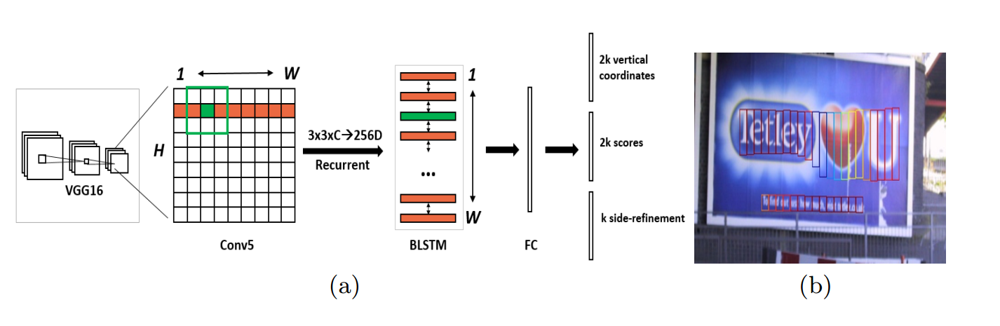
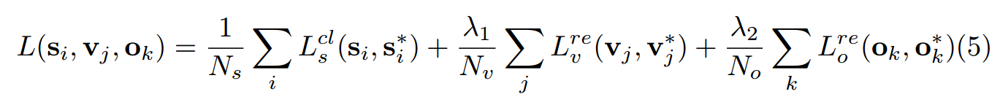
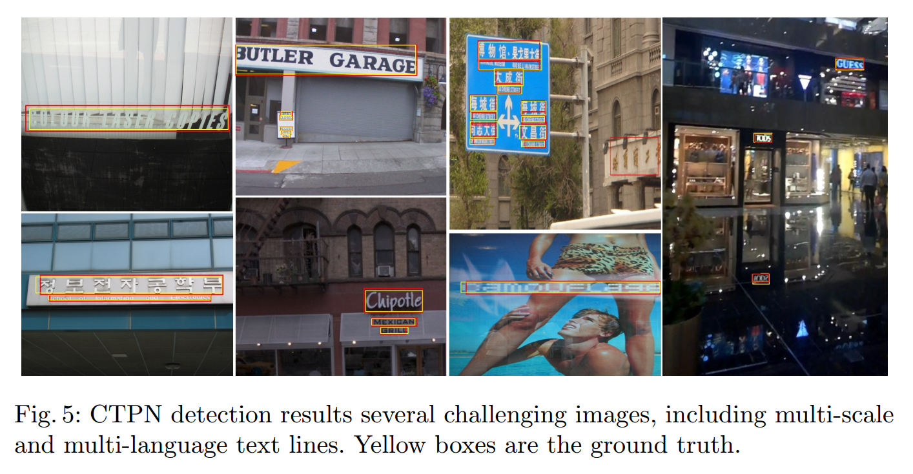
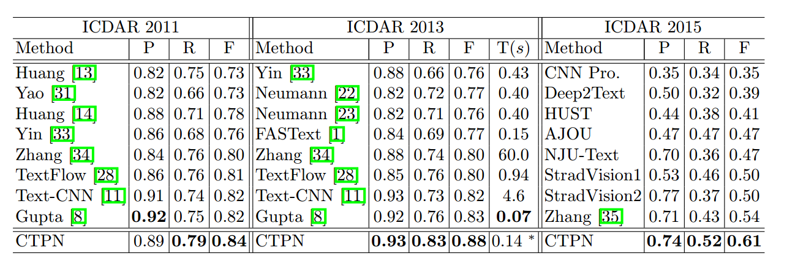
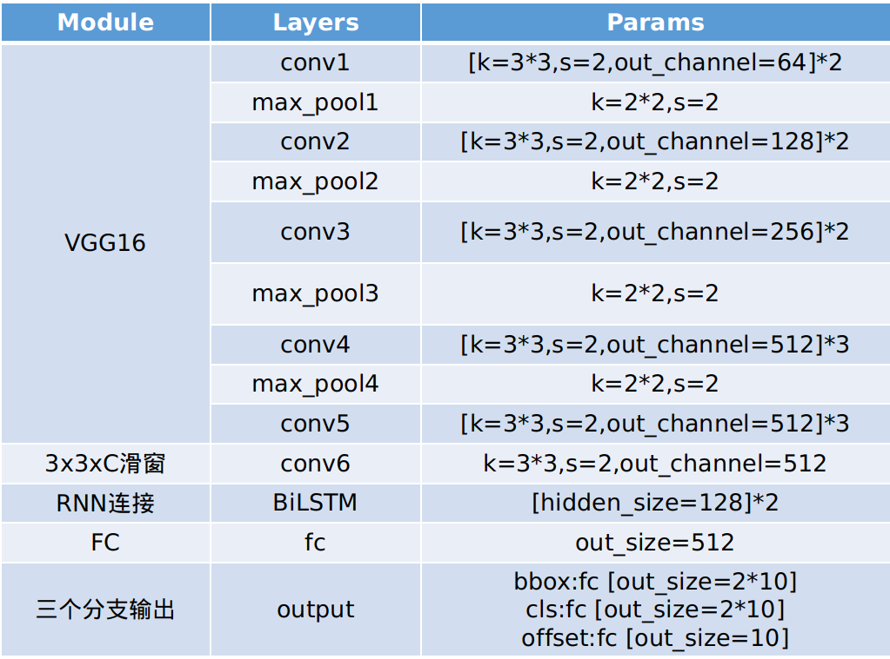

## CTPN阅读笔记

> 论文：[Detecting Text in Natural Image with Connectionist Text Proposal Network](https://arxiv.org/abs/1609.03605)
>
> 发表期刊：ECCV
>
> 发表时间：2016
>
> 代码：[Github](https://github.com/eragonruan/text-detection-ctpn)

### 1. 介绍

CTPN(Connectionist Text Proposal Network)是一种利用通用目标检测方法来进行场景文本检测的模型。考虑到文本之间或单词之间的边界不像正常的物体一样比较明显，所以直接采用通用目标检测算法效果较差，作者提出利用小检测框先检测文本行或单词的一部分，比如字符一半、几个笔画等，然后将所有的小检测框利用RNN进行连接，形成整个文本的检测框。

### 2. 模型

整体网络结构如下：

首先利用VGG16对输入图片提取特征，在最后一层特征图上`conv5`上，使用大小为$3\times3$的滑窗在`conv5`上卷积，将得到的特征向量送给RNN网络，最后使用FC对K个anchor进行文本/非文本分类预测、y坐标回归预测和边界修正预测。

整个流程分为三块：以小候选框方式检测文本、连接小候选框、对文本边界进行修正

#### 2.1 以小候选框方式检测文本

采用与faster-rcnn中的RPN类似的方式，在`conv5`特征图的每个位置上定义K个竖直长条形的anchor：宽度都是16个像素，高度为11-273，每次乘以1.4。因为`conv5`上每个像素点对应原图上的16个像素，所以在`conv5`的每个位置都设置anchor后，相当于覆盖了整个图片。对每一个anchor进行文本/非文本预测和y坐标回归。

y坐标回归使用的是相对值:
$$
v_c=(c_y-c_y^a)/h^a\\
v_h=log(h/h^a)\\
v_c^*=(c_y^*-c_y^a)/h^a\\
v_h^*=log(h^*/h^a)
$$
$c^a_y、h^a$分别是anchor的y轴中心和高度，$c_y、h$分别是预测的y轴中心和高度，$c_y^*、h^*$是GroundTruth的y轴中心和高度。

对文本/非文本预测结果>0.7的anchors运用NMS得到最后的检测框。

#### 2.2 连接小候选框

将$3\times3\times C$的特征送入BiLSTM中，输出为256D(2*128)的特征

对得分>0.7的候选框进行连接，连接方法如下：

#### 2.3 文本边界进行修正

在竖直方向上，对y坐标进行了回归，所以垂直边界定位的效果比较好，但水平方向直接是对图片按16个像素进行分割的，所以连接后的文本框左右两边定位并不够准确。所以作者对左右边界进行修正，采用回归的方式：
$$
o=(s_{side}-c_x^a)/w^a \\
o^*=(x_{side}^*-c_x^a)/w^a
$$
其中，$x_{side}$是预测的x坐标，$x_{side}^*$是Groundtruth的x坐标，$c_x^a$是anchor的x轴中心坐标，$w^a$是anchor的宽度，为16。

#### 2.4 损失函数

损失函数采用多任务损失，其中垂直坐标回归和边界补偿回归使用smooth L1损失。

### 3. 实验

### 补充

（1）网络结构参数

（2）

L1损失：
$$
L=\sum_{i=1}^n |y_i-f(x_i)|
$$
Smooth L1损失：
$$
smooth_{L1}(x)=\left\{
\begin{aligned}
0.5x^2 & &if \vline x \vline \lt 1 \\
 \vline x \vline -0.5 && otherwise 
\end{aligned}
\right.
$$

L2损失（平方误差损失、均方误差损失）：
$$
L=\sum_{i=1}^n (y_i-f(x_i))^2
$$
通常都要除以n，求样本平均损失

