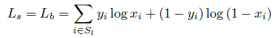
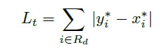

# DBNet论文阅读

> 论文：Shape Robust Text Detection with Progressive Scale Expansion Network
>
> 发表期刊：
>
> 发表时间：2019

### 1.介绍

#### 1.1为什么提出DBNet?

目前主流的检测方法都基于分割来实现的，因为分割的方法能处理任意形状的文本行。而这些方法都需要复杂的后处理操作，来将预测的像素级特征图转化为文本区域或实例，极大增加了模型的推理时间。所以，作者提出Differentiable Binarization，并将它变成网络的一个模块，在加快推理时间的同时，提高了模型的效果。

主要思路是：一般的后处理包括两步（1）固定阈值的二值化处理（2）启发式方法将像素聚集得到文本实例或者CC。作者觉得对像素聚类的方法太慢，因此作者提出了Differentiable Binarization，利用网络预测阈值图，使每个像素点具有不同的阈值。作者将二值化的模块插入到网络中去学习怎么预测阈值图。同时，由于根据阈值图得到的像素已经分得比较开了，不需要再对像素进行聚类等操作，因此，模型的推理速度有很大提升。

### 2.网络

DBNet网络结构如下：


**FPN neck结构**

`conv5`经过`conv_bn_relu`结构，然后经过上采样层（`resize`方式），得到`P5`；`conv4`也经过一样的`conv_bn_relu`结构，与`P5`相加或`concat`，再经过`conv(3*3)_bn_relu`进行平滑，最后经过上采样层得到`P4`。`conv_bn_relu`中的卷积层为`kernel_size=1*1,stride=1,output_channel=64`，主要是为了将通道数固定到同样大小，方便后面的相加或`concat`操作。

`pred`分支包含一个$3*3$卷积层和两个反卷积层。

其中，`conv3,conv4,conv5`模块的$3*3$卷积使用`deformable convolution`

具体的结构见附录代码

#### 2.1 二值化

提出的DB的公式和曲线如下：


其中，$P_{i,j}, T_{i,j}$分别表示概率特征图和阈值特征图上像素位置$(i,j)$处的值


#### 2.2 推理过程

推理时可以使用概率特征图（即推理时，不使用阈值特征图分支，可以去掉）或者使用二值特征图。

使用概率特征图的推理过程：

1.输入图片，得到对应的概率特征图；

2.进行阈值处理，阈值设置0.2，得到二值图；

3.从二值图得到连通区域；

4.对结果进行膨胀（因为概率特征图是收缩过的结果），膨胀使用Vatti Clipping算法，膨胀值为$D'$
$$
D'=\frac{A'\times r'}{L'}
$$
**多边形检测框和矩形检测框的生成**

多边形检测框利用`cv2.findContours()`函数得到连通区域的轮廓，然后利用`cv2.approxPolyDB()`以一定的误差拟合轮廓，减小轮廓的顶点数

矩形检测框利用`cv2.findContours()`函数得到连通区域的轮廓，用`cv2.minAreaRect()`对轮廓取最小外接矩形

中间包含最短边长、检测框阈值等过滤处理

#### 2.2 训练过程

##### 2.2.1 标签生成

标签分为三个特征图：二值图、概率特征图、阈值特征图。

二值图$G$：跟概率特征图$G_s$一样

概率特征图$G_s$：概率特征图是对二值图的标签进行一定的收缩得到的。采用PSENet中相同的方法。
$$
D=\frac{A \times (1-r^2)}{L}
$$
其中，$A$是检测框的面积，$L$为周长，$r$为收缩率，设置为0.4

阈值特征图$G_t$：阈值特征图是文本区域的轮廓，先对二值图G进行膨胀D，得到$G_d$，由$G_d$和$G_s$得到根据距离生成阈值特征图

**阈值特征图生成**

（1）对某一个检测框的$G_d$取最小外接矩形；

（2）计算矩形内任意点到检测框轮廓的距离，取最小的距离为该点到轮廓的距离$d$；

（3）设定最小阈值$thresh_{min}=0.3$和最大的阈值$thresh_{max}=0.7$，则该位置的标签值为
$$
x = (thresh_{max}-thresh_{min})*[1-min(d/D,1)] + thresh_{min}
$$
因此，在$G_d$和$G_S$之外的位置的值为$thresh_{min}$，而在$G_d$和$G_s$之间的位置的值跟距离相关，距离检测框的轮廓越近，值越大

##### 2.2.2 损失函数

采用多任务损失函数：
$$
L=L_s + \alpha L_b + \beta L_t
$$
其中，$L_s, L_b$损失计算采用BCE，使用OHEM



$L_t$采用L1距离，只计算$G_d$内元素



### 3.实验

在ICDAR2015上的结果如下：


### 4.附录

FPN neck :

```python
import torch
import torch.nn.functional as F
from torch import nn

from models.basic import ConvBnRelu


class FPN(nn.Module):
    def __init__(self, in_channels, inner_channels=256, **kwargs):
        """
        :param in_channels: 基础网络输出的维度
        :param kwargs:
        """
        super().__init__()
        inplace = True
        self.conv_out = inner_channels
        inner_channels = inner_channels // 4
        # reduce layers
        self.reduce_conv_c2 = ConvBnRelu(in_channels[0], inner_channels, kernel_size=1, inplace=inplace)
        self.reduce_conv_c3 = ConvBnRelu(in_channels[1], inner_channels, kernel_size=1, inplace=inplace)
        self.reduce_conv_c4 = ConvBnRelu(in_channels[2], inner_channels, kernel_size=1, inplace=inplace)
        self.reduce_conv_c5 = ConvBnRelu(in_channels[3], inner_channels, kernel_size=1, inplace=inplace)
        # Smooth layers
        self.smooth_p4 = ConvBnRelu(inner_channels, inner_channels, kernel_size=3, padding=1, inplace=inplace)
        self.smooth_p3 = ConvBnRelu(inner_channels, inner_channels, kernel_size=3, padding=1, inplace=inplace)
        self.smooth_p2 = ConvBnRelu(inner_channels, inner_channels, kernel_size=3, padding=1, inplace=inplace)

        self.conv = nn.Sequential(
            nn.Conv2d(self.conv_out, self.conv_out, kernel_size=3, padding=1, stride=1),
            nn.BatchNorm2d(self.conv_out),
            nn.ReLU(inplace=inplace)
        )
        self.out_channels = self.conv_out

    def forward(self, x):
        c2, c3, c4, c5 = x
        # Top-down
        p5 = self.reduce_conv_c5(c5)
        p4 = self._upsample_add(p5, self.reduce_conv_c4(c4))
        p4 = self.smooth_p4(p4)
        p3 = self._upsample_add(p4, self.reduce_conv_c3(c3))
        p3 = self.smooth_p3(p3)
        p2 = self._upsample_add(p3, self.reduce_conv_c2(c2))
        p2 = self.smooth_p2(p2)

        x = self._upsample_cat(p2, p3, p4, p5)
        x = self.conv(x)
        return x

    def _upsample_add(self, x, y):
        return F.interpolate(x, size=y.size()[2:]) + y

    def _upsample_cat(self, p2, p3, p4, p5):
        h, w = p2.size()[2:]
        p3 = F.interpolate(p3, size=(h, w))
        p4 = F.interpolate(p4, size=(h, w))
        p5 = F.interpolate(p5, size=(h, w))
        return torch.cat([p2, p3, p4, p5], dim=1)
```

Head:

```python
import torch
from torch import nn

class DBHead(nn.Module):
    def __init__(self, in_channels, out_channels, k = 50):
        super().__init__()
        self.k = k
        self.binarize = nn.Sequential(
            nn.Conv2d(in_channels, in_channels // 4, 3, padding=1),
            nn.BatchNorm2d(in_channels // 4),
            nn.ReLU(inplace=True),
            nn.ConvTranspose2d(in_channels // 4, in_channels // 4, 2, 2),
            nn.BatchNorm2d(in_channels // 4),
            nn.ReLU(inplace=True),
            nn.ConvTranspose2d(in_channels // 4, 1, 2, 2),
            nn.Sigmoid())
        self.binarize.apply(self.weights_init)

        self.thresh = self._init_thresh(in_channels)
        self.thresh.apply(self.weights_init)

    def forward(self, x):
        shrink_maps = self.binarize(x)
        threshold_maps = self.thresh(x)
        if self.training:
            binary_maps = self.step_function(shrink_maps, threshold_maps)
            y = torch.cat((shrink_maps, threshold_maps, binary_maps), dim=1)
        else:
            y = torch.cat((shrink_maps, threshold_maps), dim=1)
        return y

    def weights_init(self, m):
        classname = m.__class__.__name__
        if classname.find('Conv') != -1:
            nn.init.kaiming_normal_(m.weight.data)
        elif classname.find('BatchNorm') != -1:
            m.weight.data.fill_(1.)
            m.bias.data.fill_(1e-4)

    def _init_thresh(self, inner_channels, serial=False, smooth=False, bias=False):
        in_channels = inner_channels
        if serial:
            in_channels += 1
        self.thresh = nn.Sequential(
            nn.Conv2d(in_channels, inner_channels // 4, 3, padding=1, bias=bias),
            nn.BatchNorm2d(inner_channels // 4),
            nn.ReLU(inplace=True),
            self._init_upsample(inner_channels // 4, inner_channels // 4, smooth=smooth, bias=bias),
            nn.BatchNorm2d(inner_channels // 4),
            nn.ReLU(inplace=True),
            self._init_upsample(inner_channels // 4, 1, smooth=smooth, bias=bias),
            nn.Sigmoid())
        return self.thresh

    def _init_upsample(self, in_channels, out_channels, smooth=False, bias=False):
        if smooth:
            inter_out_channels = out_channels
            if out_channels == 1:
                inter_out_channels = in_channels
            module_list = [
                nn.Upsample(scale_factor=2, mode='nearest'),
                nn.Conv2d(in_channels, inter_out_channels, 3, 1, 1, bias=bias)]
            if out_channels == 1:
                module_list.append(nn.Conv2d(in_channels, out_channels, kernel_size=1, stride=1, padding=1, bias=True))
            return nn.Sequential(module_list)
        else:
            return nn.ConvTranspose2d(in_channels, out_channels, 2, 2)

    def step_function(self, x, y):
        return torch.reciprocal(1 + torch.exp(-self.k * (x - y)))

```

