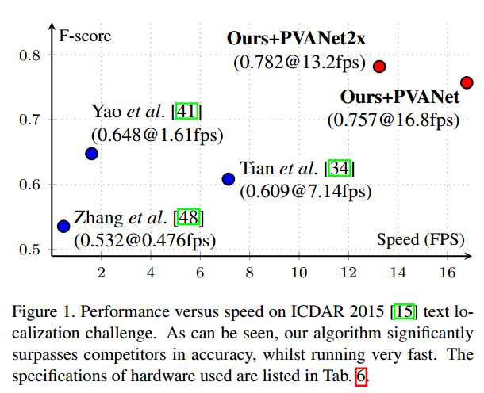
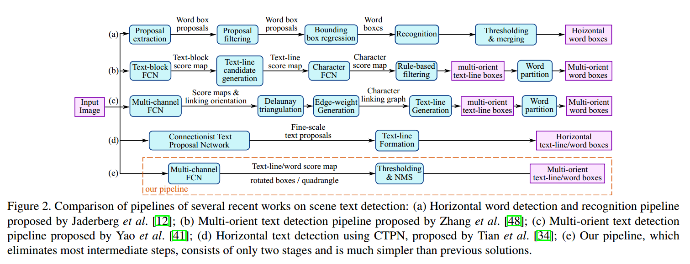
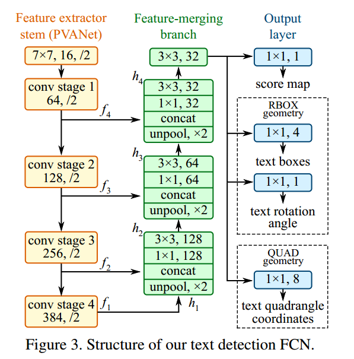
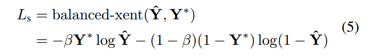
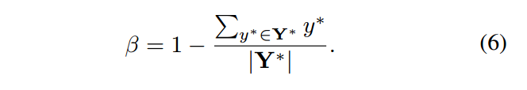
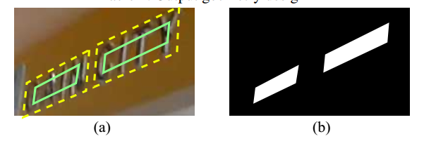
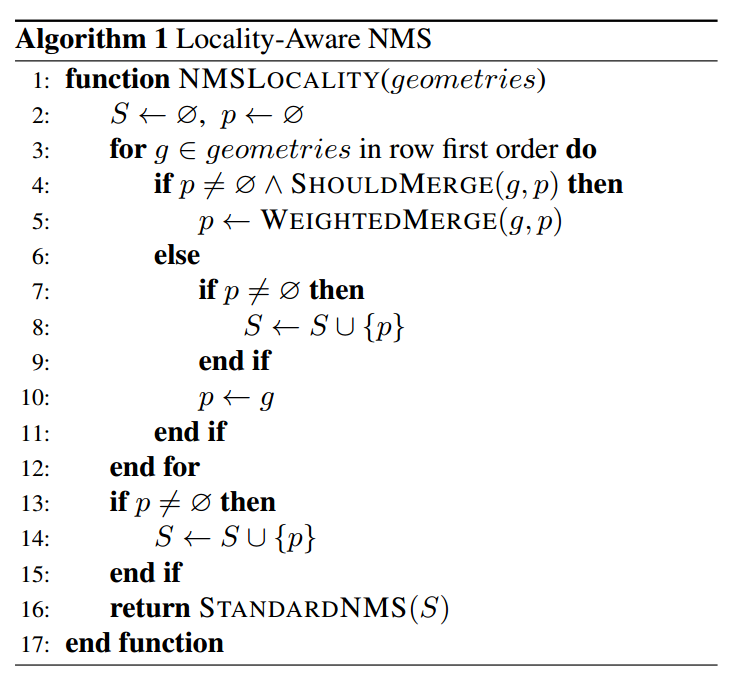
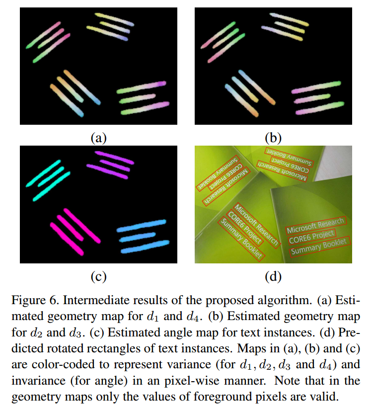
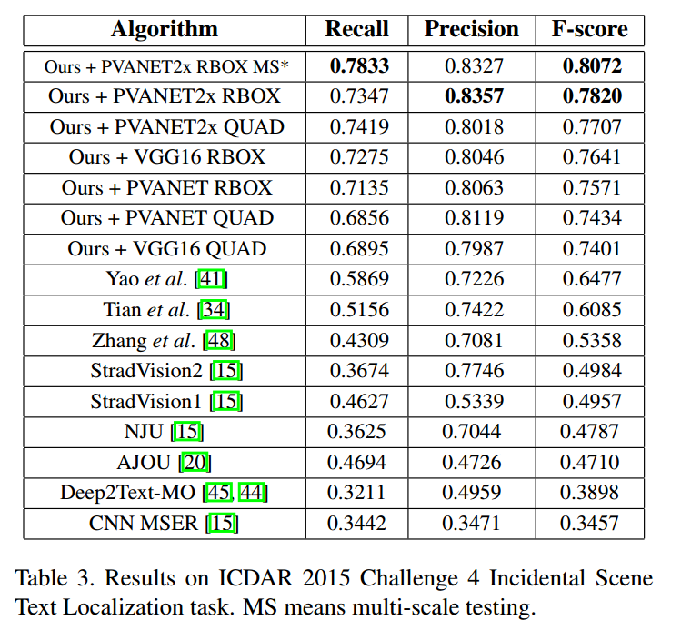
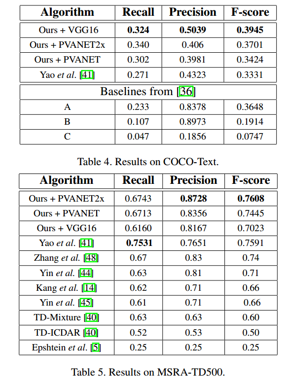

## EAST阅读笔记

> 论文：EAST：An Efficient and Accurate Scene Text Detector
>
> 发表期刊：CVPR
>
> 发表时间：2017
>
> 代码：[Github](https://github.com/argman/EAST)

### 1. 介绍

EAST是Efficient and Accuracy Scene Text  detection的缩写。EAST直接利用一个网络预测图片中的文本区域和回归区域的四边形形状，相比于之前的算法，极大简化了文本检测的步骤，同时在精度和检测速度上有了很大提升（最高16.8FPS）。

**检测流程**

分为两步：

1）利用FCN网络对每个像素进行预测，生成候选框；

2）将这些候选框送给NMS(Non-Maximum Suppression)算法，过滤得到最终的结果。

**主要贡献**

1）提出了只包含两步的文本检测算法，简化了文本检测算法的流程；

2）可以进行单词级别或文本行级别的预测，同时预测的形状可以为旋转矩形或四边形；

3）提出的算法在精度和速度上超越了当前最好的算法；

### 2. Methodology

#### 2.1 Pipline

前面提到EAST的流程主要分为两步。

第一步生成候选文本框。利用FCN网络进行像素级预测，输出为两类：

* 一类为预测的`score map`，值在[0-1]之间，表示在该像素点位置预测的检测框是文本框的置信度；
* 另一类为几何形状预测。几何形状预测表示的是从某一个像素点的角度来看，文本的检测框是什么样子的。也说是说对每个像素（正像素）预测一个候选检测框。论文中作者提出了两种形状，旋转框（RBOX）和四边形（QUAD）。假设采用RBOX，网络在几何形状预测时，输出4通道，分别表示像素距检测框上、下、左、右四条边的距离；另外，输出1通道，表示检测框的旋转角度。最后通过这5个值，可以计算出该像素位置的预测检测框。像素的`score map`值表示这个几何形状是文本框的置信度。对预测的`score map`进行阈值处理得到正像素，进而得到正像素的预测几何形状，即候选检测框。

第二步进行NMS得到最终结果。

#### 2.2 网络结构

作者在论文中实验了两种网络结构，VGG16和PVANet。上图展示的是PVANet的结构。

主要采用了特征融合的方式，虚线框中的预测几何形状二选一。

融合后的特征图经过不同的分支得到不同任务的输出。经过`1 x 1`的卷积得到`score map`，为1通道的。对于`RBOX`输出为1通道的旋转角度和4通道的距离，4通道的距离表示该像素点到检测框边界（上、右、下、左）的预测距离。对于`QUAD`输出为8通道的坐标偏移，表示检测框的四个角点相对于该像素点位置的预测的坐标偏移。

#### 2.3 损失函数

损失函数分为两部分，一部分为`score`损失，一部分为几何形状回归损失。
$$
L=L_s+\lambda_gL_g
$$

##### 2.3.1 Score Map损失

针对类别不均衡问题，使用了`class-balanced cross-entropy`的损失计算公式：

**Score Map标签如何生成？**

* 生成方法

  1. 首先生成一个与图片大小一样的矩阵，值为0
  2. 对Ground Truth检测框，进行收缩，得到图中的绿框
  3. 将绿框中的像素赋值为1，其余像素赋值为0

* 缩小四边形方法

  1. 首先定义四个顶点$Q=\{p_i|i \in \{1,2,3,4\} \}$，四个顶点逆时针排列，$p_i=(x_i,y_i)$

  2. 计算收缩的参考长度$r_i$，即选取与该顶点相连的两条边中的较小边的长度为$r_i$
     $$
     r_i=min<D(p_i,p_{(i mod 4)+1}),D(p_i,p_{((i+2)mod 4) +1})>
     $$
     $D(p_i,p_j)$表示两顶点间的距离

  3. 对于边$<p_i,p_{(i mod 4)+1}>$进行收缩，两顶点分别向内收缩$0.3r_i$和$0.3r_{(imod4)+1}$像素

##### 2.3.2 几何损失

由于文本的大小差异较大，使用L1或L2损失会使得损失偏向于大或长的文本区域 **（为什么？？？解答：假设输入为$y'$，真实值为$y$，在L1和L2损失都涉及到$(y'-y)$，在大或长的文本中，该值很可能比较大，而对于小文本，预测值和真实值的差距较小，所以总损失中大或长文本的损失占主导作用）**。所以作者采用了具有尺度不变性的回归损失。具体见论文。

#### 2.4 Locality-Aware NMS

主要是考虑到产生的候选框较多，使用标准的NMS算法比较耗时，所以作者提出了`locality-aware NMS`，主要的思想是：考虑到邻近的像素预测的候选框应该是类似的，先进行合并，再NMS。

### 3. 实验结论

中间结果：

在ICDAR2015、COCO-Text、MSRA-TD500上的结果：

------

### 总结

个人觉得EAST的主要创新点在于简化了文本检测的流程。读完后也有一些收获：

1. 作者在预测score map时，没有直接使用检测框作为Ground Truth，而是先收缩了一下，应该是考虑到了文本靠得近时语义分割不能很好的区分不同文本。
2. 作者使用了PVANet，从实验结果来看效果还不错，可以后续学习一下，目前比较少看见有论文里使用这个PVANet。