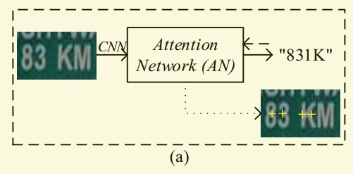
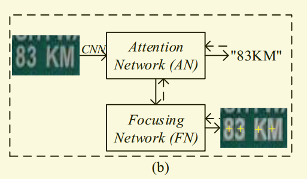
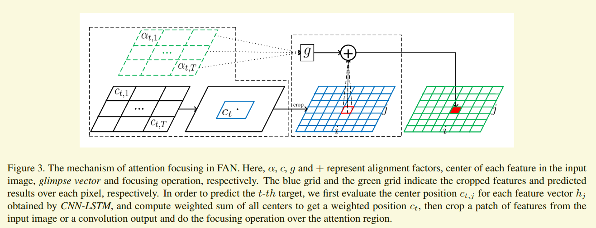
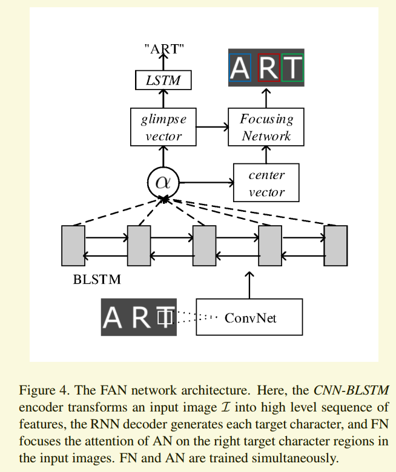

# Focusing Attention: Towards Accurate Text Recognition in Natural Images阅读笔记

> 论文：Focusing Attention: Towards Accurate Text Recognition in Natural Images
>
> 发表期刊：PAMI
>
> 发表时间：2018

## 1. Abstract

## 2. Introduction

### 2.1 为什么

在自然场景文字识别中，所涉及的图片很多都是复杂的（比如变形、文字重叠、字符字体 大小 和颜色不统一以及背景复杂）或者质量低的（由于光照变化、模糊、不完整和噪声等）。对于这一类的图片，目前的基于注意力机制的文字识别算法识别效果较差。作者发现，出现这个问题的主要原因是由于图片的问题而导致注意力模型不能很好的对齐。作者称这种现象为“注意力漂移”现象。

正常情况下，注意力网络估计出的注意力的中心(图中黄色"+")应该与每个字符对齐。由于图片存在各种问题导致注意力中心没有和字符对齐，识别结果失败。

所以作者提出了FAN（Focusing Attention Network）网络，利用FN（Focusing Network）来调整AN（Attention Network）估计出来的注意力中心，再根据调整后的注意力中心来识别字符。

结构如图：

### 2.2 主要工作

* 提出了"注意力漂移"的概念

* 提出了FAN网络

* 采用了ResNet来特征提取

* 在几个标准数据集上取得目前最好的结果

## 3. FAN模型

输入图片经过CNN－LSTM提取特征后得到特征向量，AN根据特征向量计算向量与目标标签的对齐因子。对齐因子对应输入图片的注意力区域。FN首先计算对齐因子在输入图片对应的注意力区域，然后根据由AN计算出的glimpse vector生成注意力区域的概率分布。AN反过来根据FN的输出更新glimpse vector。

### 3.1 Attention Network

通常，图片$I$经过CNN－LSTM提取特征得到特征序列，表示为$Encoder(I)=(h_1, \cdots, h_T)$。而基于注意力机制的解码器利用RNN直接根据特征序列生成目标序列（$y_1, \cdots, y_M$）。

##### 基于注意力机制的解码器

基于注意力机制的解码器框架是由Bahdanau等人首次提出的。在第$t$步时，解码器输出$y_t$
$$
y_t=Generate(S_t, g_t)
$$
其中，$s_t$是RNN在$t$时刻的隐藏状态，$g_t$是特征序列（$h_1, \cdots, h_T$）的加权和。
$$
s_t=RNN(y_{t-1}, g_t, s_{s-1})
$$

$$
g_t=\sum^T_{j=1}\alpha_{t,j}h_j
$$

其中，$\alpha_{t,j} \in \R^T$是注意力权重的向量，也叫做对齐因子。对齐因子的计算公式如下：
$$
e_{t,j}=v^Ttanh(Ws_{t-1}+Vh_j+b)
$$

$$
\alpha_{t,j}=\frac{exp(e_{t,j})}{\sum^T_{j=1}exp(e_{t,j})}
$$

其中，$v,W,v$和$b$都是训练参数。

在这里，$Generate$函数代表前馈网络，$RNN$代表LSTM循环神经网络。通常，在输出时，用EOS（end of sentence）代表输出结束。

AN网络的损失函数为：
$$
L_{Att}=-\sum_t\ln{P(\hat y｜I，\theta)}
$$
其中，$\hat y$是标签的第$t$个个字符，$\theta$是网络所有参数的向量。

### 3.2 Focusing Network

FN的执行过程如图：

主要分两步：1、为每个预测标签计算注意力中心；2、通过计算注意力区域的概率分布将注意力集中在目标区域。

#### 3.2.1 计算注意力中心

在卷积和池化的过程中，假设输入大小为$H_i \times W_i$，输出大小为$H_o \times W_o$，根据卷积的原理，可以得到
$$
H_o=(H_i+2\times pad_H-kernel_H)/stride_H+1
$$

$$
W_o=(W_i+2\times pad_W-kernel_W)/stride_W+1
$$

因此，对于第L层上的位置$(x,y)$，可以计算出它在第$L-1$层上的感受野对应的bounding box坐标$r=(x_min, x_max, y_min, y_max)$：
$$
x_min = (x-1)\times stride_W+1-pad_W \\
x_max = (x-1) \times stride_W-pad_W+kernel_W \\
y_min = (y-1)\times stride_H+1-pad_H \\
y_max = (y-1) \times stride_H-pad_H+kernel_H
$$
在第$t$步，我们可以递归的调用上述的公式，计算$h_j$在输入图片上的感受野，并将它的中心作为注意力的中心：
$$
c_{t,j}=location(j)
$$
计算每一个特征向量$h_j$对应的注意力中心，根据对齐因子加权求和计算出目标$y_t$在输入图片上对应的注意力中心：
$$
c_t = \sum^T_{j=1}\alpha_{t,j}c_{t,j}
$$

#### 3.2.2 将注意力集中于目标区域

有了目标$y_t$的注意力中心后，我们就可以从输入图片或者从卷积的输出中截取一小块：
$$
F_t=Crop(F,c_t,P_H,P_W)
$$
其中，$F$是输入图片或者卷积的特征图，$P$设置为输入图片中ground_truth区域的最大值。

然后，在截取的特征图上计算能量分布：
$$
e^{(i,j)}=tanh(Rg_t+SF_t^{(i,j)}+b)
$$
其中，$R$和$S$是训练参数，$(i,j)$代表第$(i\times PW+j)$个特征向量。

最后，计算在选择区域上的K个标签类别的概率分布：
$$
p_t^{(i,j,k)}=\frac{exp(e_t^{(i,j,k)})}{\sum^K_{k^{'}}exp(_t^{(i,j,k^{'})})}
$$
FN的损失函数为：
$$
L_foucs=-\sum_t^M{\sum_i^{P_W}\sum_j^{P_H} \log p(\hat y_t^{(i,j)}|I, \omega)}
$$
**???? (FN网络最后是怎么样更新glimpse vector的？计算出的概率分布有什么用？)**

### 3.3 FAN训练

作者使用ResNet代替以前的VGG16来提取图片特征，同时将AN和FN结合成一个网络，可以同时进行训练，如下图所示：

网络的总的损失函数为AN的损失和FN的损失的加权和：
$$
L=(1-\lambda)L_{Att}+\lambda L_{focus}
$$
其中，$\lambda(0 \le \lambda \lt 1)​$是可调节的参数。

