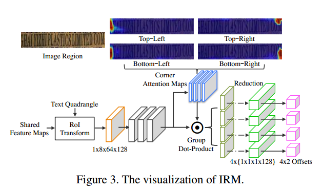

# LOMO论文阅读

>论文：Look More Than Once: An Accurate Detector for Text of Aribitrary Shapes
>
>发表时间：

### 一、介绍

作者认为目前文字检测存在两个问题：（1）受CNN网络感受野的影响，感受野没有办法覆盖整个长文本，所以无法检测长文本；（2）

使用旋转矩形框或者多边形没有办法表示不规则文本；如图所示。

因此，作者提出了LOMO模型。LOMO模型包括三个部分：direct regressor（DR）、iterative refinement module（IRM）、shape expression module（SEM）。DR模块直接回归出文本区域的候选框，但根据（1）候选框可能没有包含整个文本行，这时利用IRM逐步改善候选框，然后，利用SEM得到文本行的几何特征（分割），包括：text region、text center line、border offsets。最后，根据几何特性得到检测框。

### 二、LOMO

#### 2.1 整体结构

整体结构如图：

骨架网络采用的是ResNet50+FPN，输出特征图的大小为原图1/4，通道数为128。后面接DR、IRM、SEM三个模块，并且三个模块共用骨架网络提取的特征图。

#### 2.2 Direct Regressor

DR模块采用与EAST模型类似的方法：对正样本像素点进行像素级的回归。DR模块有两个输出，一个输出为text/no text分类，2通道，标签也采用的与EAST相似的收缩版本；另一个输出为位置回归，输出为8通道，表示该像素点到四个角的offset。

DR模块的损失为分类损失和回归损失的加权和：
$$
L_{dr}=\lambda L_{cls} + L_{loc}
$$
其中，$L_{cls}$使用的是作者改进的Dice Loss，$L_{loc}$使用的是Smooth_L1 Loss。

#### 2.3 Iterative Refinement Module

IRM模块参考的是Faster-RCNN的方法。在Faster-RCNN中，RPN网络得到目标的候选框，利用ROI Pooling层根据候选框从整个输入图像的特征图中得到候选框的特征图，然后通过预测offset的方法，对候选框进行调整。IRM模块可以根据需要进行一次或多次。

IRM模块的原理类似。根据DR模块得到的候选框，利用ROI Transform层从共享的特征图中得到候选框的特征图，然后根据特征图预测四个角的坐标偏移。同时，作者认为四个角包含更多的边界特征，所以作者加入了conner attention map。IRM模块如图：

#### 2.4 Shape Expression Module

SEM模块的作用是解决不规则文本的表示问题。作者采用的是Mask-RCNN的思想，直接对候选框中的文本区域进行分割。SEM模块的输出为三个部分：（1）text region：是二值图，表示像素是文本还是非文本；（2）text center line：也是二值图；（3）border offsets：是4通道的特征图。

SEM模块的结构如图：

如何从SEM模块的输出生成检测框？

#### 2.5 训练

训练损失如下：
$$
L=\gamma_1 L_{dr} + \gamma_2 L_{irm} + \gamma_3 L_{sem}
$$
训练采用两阶段方法：第一阶段，在SynthText上对DR模块进行训练；第二阶段，整个模型在具体的数据集上end-to-end进行训练

#### 三、实验

预测结果展示：

