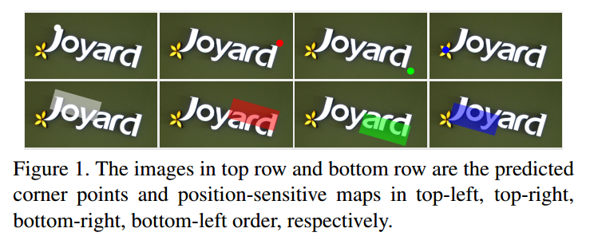
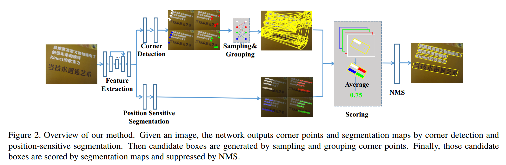
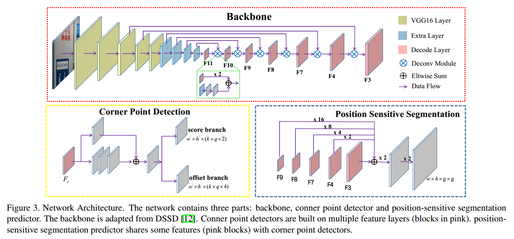

## Multi-Oriented Scene Text Detection via Corner Localization and Region Segmentation阅读笔记

> 论文：Multi-Oriented Scene Text Detection via Corner Localization and Region Segmentation
>
> 发表期刊：CVPR
>
> 发表时间：2018

### 1.介绍

当前基于深度学习的文字检测算法大致分为两类：

1）采用通用目标检测的方法，定位场景中的文本，并回归文本的边界框

难点：文本的随机旋转角度和大的长宽比造成检测困难

2）直接分割出文本区域

难点：需要复杂的后处理

本文在些基础上，提出了结合以上两种方法的文字检测算法，不仅能够处理长的、具有旋转角度的文本，而且不需要复杂的后处理。

#### 1.1 场景文字检测具有挑战性

* 内因
* 外因

#### 1.2 算法流程

流程如下：

1) 检测输入图片的角点（corner points，左上、右上、右下、左下），同时得到图片的位置敏感图（position-sensitive maps，不是文本/非文本分类图, text/non-txt map）

2) 通过采样(sampling)和组合(grouping)角点得到候选框

3) 利用位置敏感图为候选框评分

4) 非极大值抑制算法(NMS)筛选出最终的检测框

#### 1.3 本文的贡献

1) 提出了一种结合目标检测和分割的文字检测算法；

2) 提出了`rotated position-sensitive ROI average pooling layer`，可以处理任意方向的候选框；

3) 提出的算法能同时处理多方向场景文本中的各种挑战，包括旋转、变化的长宽比、文本靠得很近等；

4) 在精度和效率上达到较好的结果

### 2. 模型

#### 2.1 特征提取模块

网络的主干是采用的VGG16结构，同时采用了FPN中使用的特征融合结构，网络结构如图。

网络的前几层保持了VGG16中的`conv1-conv5`层，`fc6 fc7`两层替换成了卷积层`conv6和conv7`，同时在`conv7`后面新增加了`conv8-conv11`四层卷积层。特征融合结构对`conv3 conv4 conv7 conv8 conv9 conv10`和`conv11`层进行级得到，其中采用了256通道的`deconvolution`模块，它们的输出分别定义为：$F_3、F_4 、F_7、F_8、F_9、F_{10}、F_{11}$。

#### 2.2 Corner Detection

每一个bounding box $R=(x,y,w,h,\theta)$都有4个角点，分别为左上、右上、右下、左下，可以用坐标${(x_1,y_1),(x_2,y_2),(x_3,y_3),(x_4,y_4)}$表示。本文将角点定义为水平正方形$C＝(x_c,y_c,ss,ss)$，其中$(x_c,y_c)$为角点的坐标，$ss$为bounding box$R$的较短边的长度。

角点检测时输出为两个分支：`classification scores`和`offsets`分支。

考虑到某些角点会重合，比如一个框的右下和另一个框的左上，所以作者为每一个`default box`预测四种类型角点的`scores`和`offsets`。

假设特征图尺寸为$m\times n$，每个单元有$k$个`default box`，角点类型数为$q$，则`scores`分支为每种角点类型预测2个scores，`offsets`分支为每种角点类型预测4个offsets，所以，最终的输出为：`scores`：$m*n*(k*q*2)$，`offsets`：$m*n*(k*q*4)$。

#### 2.3 Position-Sensitive Segmentation

