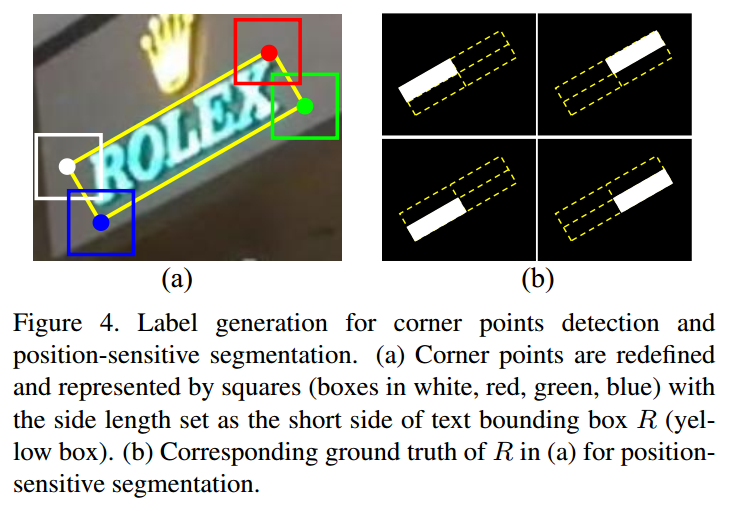
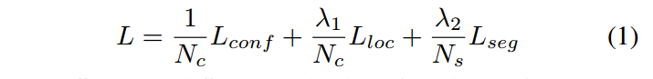
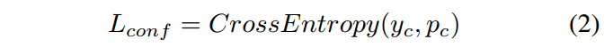
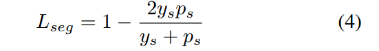
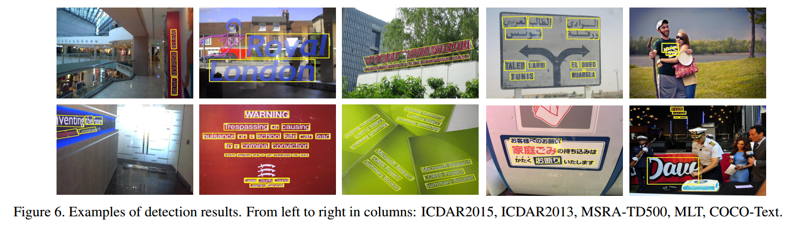
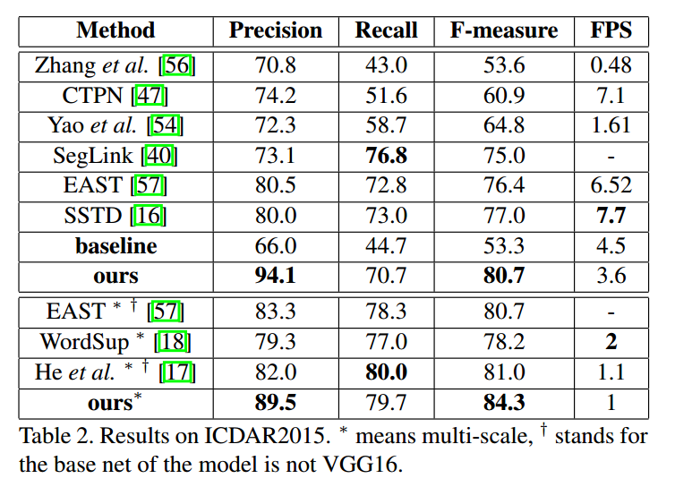
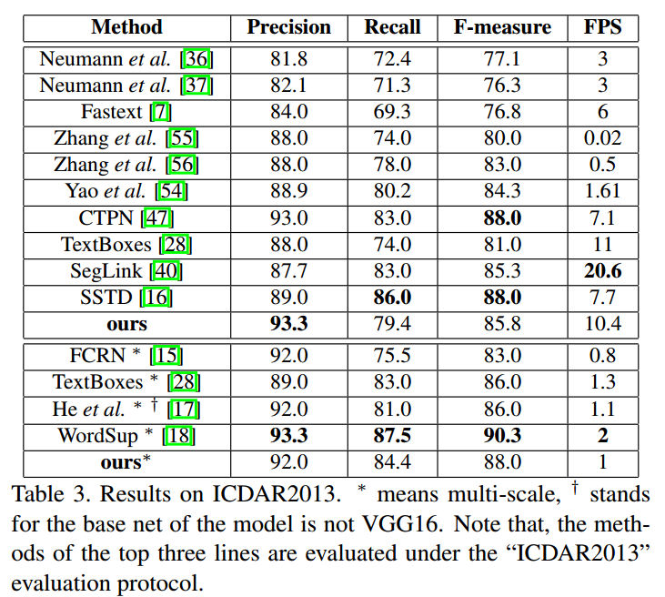
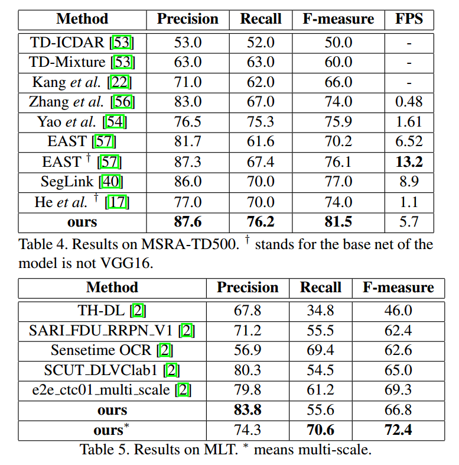

## Multi-Oriented Scene Text Detection via Corner Localization and Region Segmentation阅读笔记

> 论文：Multi-Oriented Scene Text Detection via Corner Localization and Region Segmentation
>
> 发表期刊：CVPR
>
> 发表时间：2018
>
> 代码：[Github](https://github.com/lvpengyuan/corner) 

### 1.介绍

当前基于深度学习的文本检测算法大致分为两类：

1）采用通用目标检测的方法，定位场景中的文本，并回归文本的边界框

难点：文本框存在旋转角度，而且长宽比差异大，造成了检测困难

2）采用图像分割的方法，直接分割出文本区域

难点：需要复杂的后处理

这篇论文在这些基础上，提出了结合以上两种方法的文本检测算法，不仅能够处理长的、具有旋转角度的文本，而且不需要复杂的后处理。

#### 1.1 场景文字检测具有挑战性

* 内因

  1. 自然场景中的文本可能以任意角度出现；
  2. 文本的长宽比差异很大；
  3. 文本可能以字符、单词或行文本的形式存在，算法很难确定文本的边界

* 外因

  来自于环境。导致图片有噪声、模糊或遮挡。

#### 1.2 算法流程

流程如下：

1) 检测输入图片的角点（corner points，左上、右上、右下、左下），同时得到图片的位置敏感图（position-sensitive maps，不是文本/非文本分类图, text/non-txt map）

2) 通过采样(sampling)和组合(grouping)角点得到候选框

3) 利用位置敏感图为候选框评分

4) 利用非极大值抑制算法(NMS)筛选出最终的检测框

#### 1.3 本文的贡献

1) 提出了一种结合目标检测和分割的文字检测算法；

2) 提出了`rotated position-sensitive ROI average pooling layer`，可以处理任意方向的候选框；

3) 提出的算法能同时处理多方向场景文本中的各种挑战，包括旋转、变化的长宽比、文本靠得很近等；

4) 在精度和效率上达到较好的结果

### 2. 模型

#### 2.1 特征提取模块

网络的主干是采用的VGG16结构，同时采用了FPN中使用的特征融合结构，网络结构如图。

网络的前几层保持了VGG16中的`conv1-conv5`层，`fc6 fc7`两层替换成了卷积层`conv6和conv7`，同时在`conv7`后面新增加了`conv8-conv11`四层卷积层。特征融合结构对`conv3 conv4 conv7 conv8 conv9 conv10`和`conv11`这几层进行级联得到，其中采用了256通道的`deconvolution`模块，它们的输出分别定义为：$F_3、F_4 、F_7、F_8、F_9、F_{10}、F_{11}$。

#### 2.2 Corner Detection

每一个bounding box $R=(x,y,w,h,\theta)$都有4个角点，分别为左上、右上、右下、左下，可以用坐标${(x_1,y_1),(x_2,y_2),(x_3,y_3),(x_4,y_4)}$表示。本文将角点定义为水平正方形$C＝(x_c,y_c,ss,ss)$，其中$(x_c,y_c)$为角点的坐标，$ss$为bounding box$R$的较短边的长度。

角点检测时输出为两个分支：`classification scores`和`offsets`分支。

考虑到某些角点会重合，比如一个框的右下和另一个框的左上，所以作者为每一个`default box`预测四种类型角点的`scores`和`offsets`。

假设特征图尺寸为$m\times n$，每个单元有$k$个`default box`，角点类型数为$q$，则`scores`分支为每种角点类型预测2个scores，`offsets`分支为每种角点类型预测4个offsets，所以，最终的输出为：`scores`：$m*n*(k*q*2)$，`offsets`：$m*n*(k*q*4)$。

#### 2.3 Position-Sensitive Segmentation

以前的基于分割的文字检测算法都直接生成分割图，分割图表示每个像素属于文本类别的概率，但是直接通过分割的结果图很难将文本区分开。所以，这里参考InstanceFCN中采用的positiion-sensitive segmentation。

**原理：**预测的像素之间带有相对位置的信息。将每个bounding box分成$g\times g$个bin，$g$设为2，则四个bin分别代表文本的左上、右上、右下和左下四个区域，然后利用分割的方法为每个像素预测属于这4个bin的概率，而不是属于文本的概率。

Position-sensitive segmentation与Corner detection共用一个网络，利用$F_3,F_4,F_7,F_8,F_9$这几层特征图通过上采样得到，最后输出的通道数为$g \times g$。

### 3. 训练和推断

#### 3.1 标签生成

利用Ground Truth分别生成角点检测和分割的标签

#### 3.2 损失函数

损失函数由三部分组成：

其中，$L_{conf}$为角点的confidence score损失，采用交叉熵损失函数：

$L_{loc}$为角点的offset回归损失，使用`Smooth L1 loss`:

$L_{seg}$为分割损失，采用`Dice loss`:

#### 3.3 推断

对输入图片计算角点和position-sensitive segmentation图，通过采样和组合角点生成候选框，通过`Rotated Position-Sensitive ROI Average pooling layer `利用分割图对候选框打分，最后过滤得分低的候选框。

#### 3.4 训练

在`SynthText`数据上预训练1个epoch，然后在其他数据集上进行微调。

#### 4. 实验

