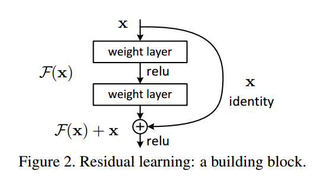
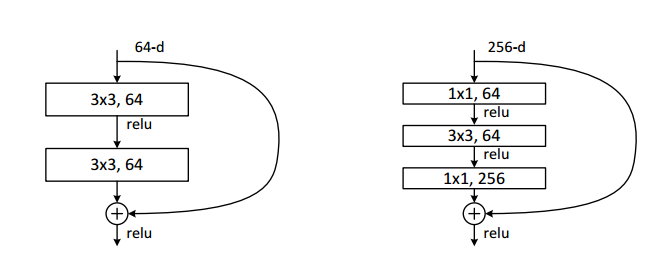
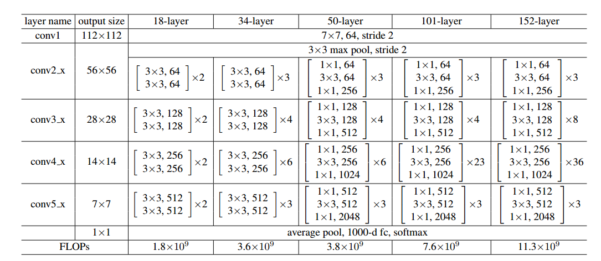

# ResNet

> 论文：[Deep Residual Learning for Image Recognition](https://arxiv.org/abs/1512.03385)
>
> 发表期刊：CVPR
>
> 发表时间：2015
>
> 代码：

[ResNet--简书](https://www.jianshu.com/p/d63ac154c8fc)，文章写得很好，这里偷个懒直接搬运过来了 : )

### 1. 为什么提出Resnet

随着网络的加深，出现了**训练集准确率下降的现象**（退化现象），我们可以确定这不是由于过拟合造成的(过拟合的情况训练集应该准确率很高)；所以作者针对这个问题提出了一种全新的网络，叫深度残差网络，它允许网络尽可能的加深，其中引入了全新的结构：

**残差指的是什么？** 

其中ResNet提出了两种mapping：

- 一种是identity mapping，指的就是图1中“弯弯的曲线”。identity mapping顾名思义，就是指本身，也就是公式中的$$x$$。
- 另一种residual mapping，指的就是除了“弯弯的曲线”那部分。而residual mapping指的是“差”，也就是$$y−x$$，所以残差指的就是$$F(x)$$部分。

所以最后的输出是$$ y=F(x)+x$$

**为什么ResNet可以解决“随着网络加深，准确率不下降”的问题？**
 理论上，对于“随着网络加深，准确率下降”的问题，Resnet提供了两种选择方式，也就是identity mapping和residual mapping，如果网络已经到达最优，继续加深网络。residual mapping将被push为0，只剩下identity mapping，这样理论上网络一直处于最优状态了，网络的性能也就不会随着深度增加而降低了。

### 2.ResNet结构

ResNet使用了一种连接方式叫做“shortcut connection”，顾名思义，shortcut就是“抄近道”的意思。
 我们可以看到一个“弯弯的弧线”这个就是所谓的“shortcut connection”，也是文中提到identity mapping，这张图也诠释了ResNet的真谛，当然大家可以放心，真正在使用的ResNet模块并不是这么单一，文章中就提出了两种方式：

这两种结构分别针对ResNet34（左图）和ResNet50/101/152（右图），一般称整个结构为一个”building block“。其中右图又称为”bottleneck design”，目的一目了然，就是为了降低参数的数目，第一个1x1的卷积把256维channel降到64维，然后在最后通过1x1卷积恢复，整体上用的参数数目：1x1x256x64 + 3x3x64x64 + 1x1x64x256 = 69632，而不使用bottleneck的话就是两个3x3x256的卷积，参数数目: 3x3x256x256x2 = 1179648，差了16.94倍。
 对于常规ResNet，可以用于34层或者更少的网络中，对于Bottleneck Design的ResNet通常用于更深的如101这样的网络中，目的是减少计算和参数量（实用目的）。

**ResNet常见的结构**

