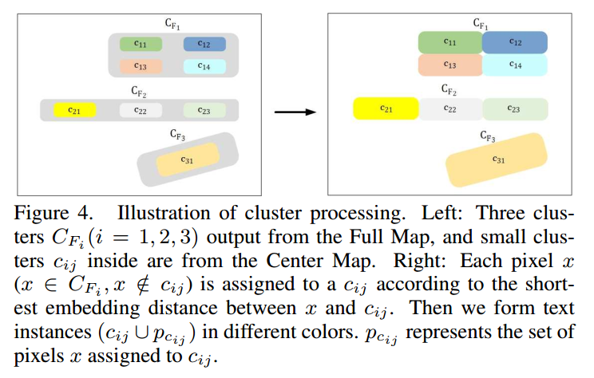

## Learning Shape-Aware Embedding for Scene Text Detection阅读笔记

> 论文：[Learning Shape-Aware Embedding for Scene Text Detection](http://jiaya.me/papers/textdetection_cvpr19.pdf)
>
> 发表期刊：CVPR
>
> 发表时间：2019
>
> 代码：暂无

### 1. 介绍

作者采用了实例分割的方法去解决场景文本检测问题。在这类方法中存在的主要问题之一是从分割的结果中很难将文本区域之间分隔开，所以作者提出了一种`shape-aware embedding`来表示像素，在这个新的表示空间中将像素聚集到不同的`cluter`中，达到将文本区域分开的效果。通俗的讲就是将原本在二维空间（分割图）很难区分的像素，映射到另一个空间，再另一个空间做聚类将它们区分开，再返回原分割图来得到文本实例分割的结果。

### 2. 模型

#### 2.1 网络结构

网络结构采用的是分割的结构。特征提取部分使用ResNet50网络，也采用了特征融合结构，但是使用了对称的两个特征融合分支，同时特征融合部分使用类似PANet中的融合方式。

两个分支分别为Shape-Aware Embedding分支和Segmentation Masks分支。

##### 2.1.1 Shape-Aware Embedding

考虑到在场景中，两个文本间的边界不明显而且文本的长宽比差异性大，作者提出使用利用网络学习出文本的shape-aware embedding来解决这两个问题。

利用融合后的特征图和2通道的位置信息计算得到embedding特征图，输出为8通道，即每个像素映射为8维的embedding feature。

基于embedding features，作者提出了Shape-Aware Loss（SA Loss）。

SA Loss与Disc Loss对比：

##### 2.1.2 Segmentation Masks

这个分支输出两种分割图：Full Map和Center Map。这部分的损失使用的是Dice loss，总损失为两个分割图的损失的加权和。其中，Center Map的标签采用EAST中的方式由Full Map收缩得到，收缩系数$r=0.7$。

整个网络的损失即为两个分支的损失之和。

### 2.2 如何得到检测结果

利用网络可以得到三种图：Embedding map、Full Map和Center Map。作者根据这三种图直接得到最终的文本检测结果。

大概的流程：利用Full Map和Center Map分别得到它们的clusters，再对属于Full Map但不属于Center Map的像素判断它属于哪个Center Map的cluster。而判断的准则是Embedding map计算该像素到各个cluster的距离，选择距离最近的cluster。就可以得到文本的实例分割结果，再对分割结果找到最小的bounding box就得到检测框。

### 3. 实验结论

实验在SynthText数据集中预训练，然后再各个测试集上微调进行的。

### 总结

本文最大的亮点是作者针对利用分割来做文本检测时存在的文本区域之间难以区分的问题，提出了学习一个shape-aware embedding，在映射后的空间中判断像素属于哪个文本区的思想。

然后，这篇论文中作者很多东西都是在前人的基础上直接拿过来用或改进的，比如FPN 、PANet、ResNet50中的结构和discriminative loss (Disc Loss)、Dice Loss等损失，所以还是要多看看别人方法，借鉴别人的优点。

