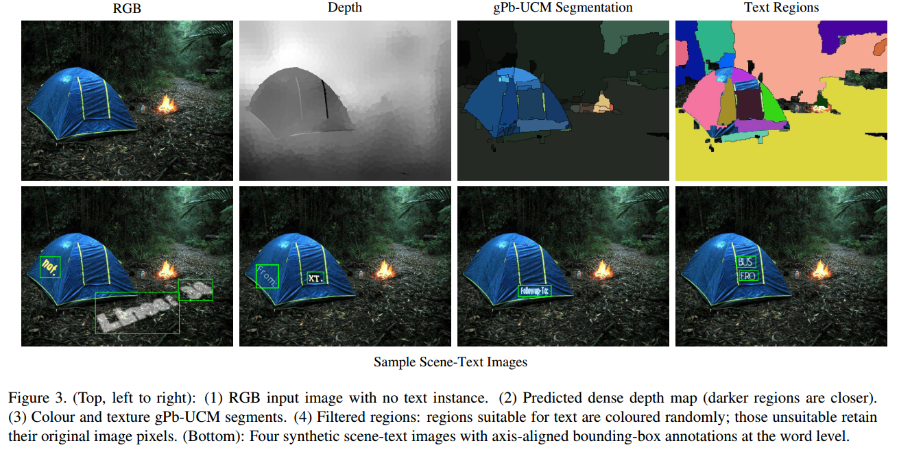
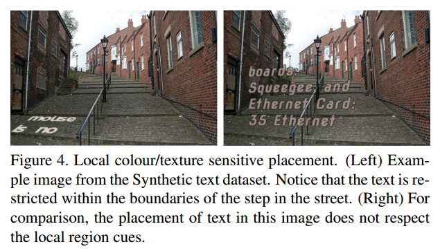

# SynthText论文阅读

> 论文：Synthetic Data for Text Localisation in Natural Images
>
> 发表期刊：CVPR
>
> 发表时间：2016
>
> 代码：

这篇论文主要提出了一种文本检测数据集的合成方法，利用提出的方法，作者合成了800k张文本检测图片。合成数据集的链接：[SynthText](http://www.robots.ox.ac.uk/~vgg/data/scenetext)

### 1. 数据集合成

合成的Pipeline可以总结为如下几步：

（1）获取合适的文本和背景图片；

（2）利用局部颜色和纹理信息，将背景图片分割成多个区域；

（3）利用CNN预测背景图片的深度图（depth map），在估计背景图片各个区域的表面法线（normal）；

（4）随机选择文本的颜色、字体、轮廓等，渲染得到文本；

（5）将文本融合进背景图片；

### 2. 背景分割与几何估计

第一：通常文字只会出现在颜色和纹理比较统一的区域，因此，作者采用gPb-UCM方法对背景图片进行分割。下图是考虑局部颜色和纹理信息时与不考虑时的对比：

第二：文字通常时印在物体的表面的，因此，文字的透视方向需要与物体表面一致。作者首先利用CNN预测背景图片的深度图，然后在每个区域的方向。具体方法如下：

（1）利用`Deep convolutional neural fields for depth estimation from a single image`中的方法预测深度图；

（2）使用RANSAC估计区域的法线；

### 3. 文本渲染

作者首先从IIIT5K数据集中学习一个调色板：对每个裁剪的小图，利用K-means聚类成两类，一个是前景颜色，一个是背景颜色；但渲染文本时，根据渲染文本的区域的颜色，从调色板中选择对应的前景颜色作为文本的颜色。