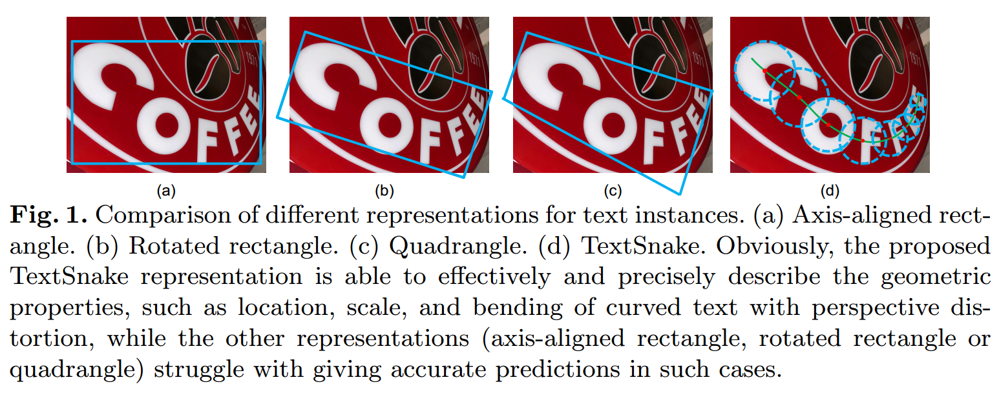
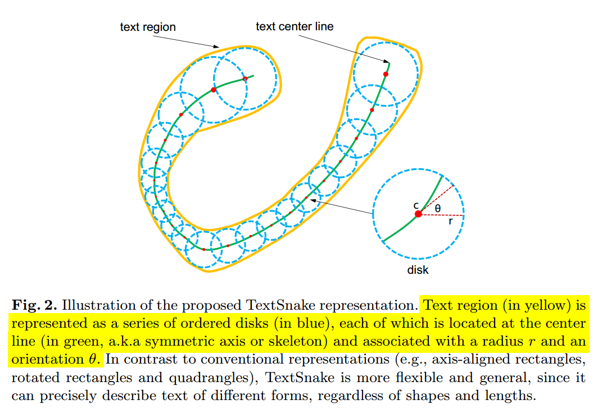
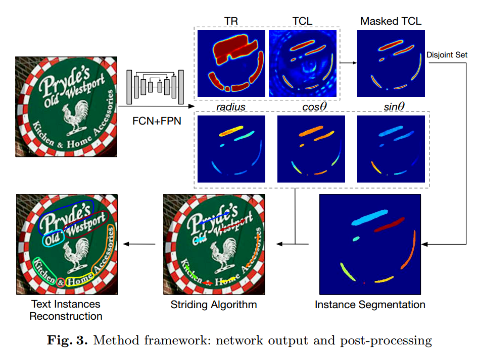
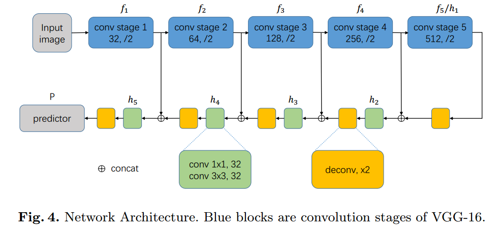
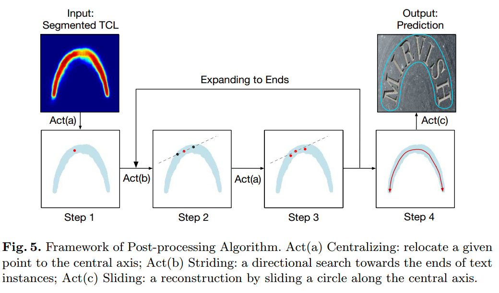
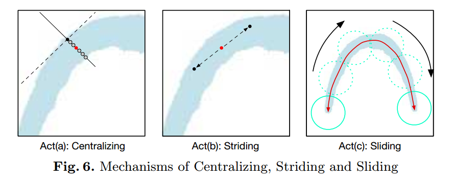
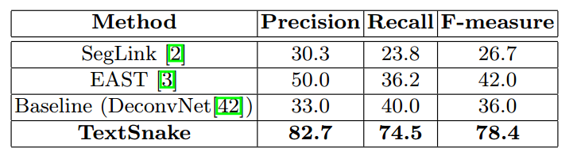
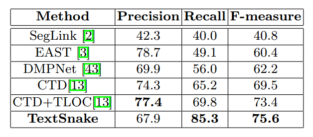

# TextSnake阅读笔记

[TOC]

> 论文：TextSnake: A Flexible Representation for Detectng Text of Arbitrary Shapes
>
> 发表期刊：ECCV
>
> 发表时间：2018
>
> 日期：2019.07.22

### 1. 摘要

在这篇文章之前，文字检测中常用轴对齐的矩形、旋转矩形和四边形来表示文本，但这些表示方式在表示弯曲的文本时有很大的局限性，不能很好的将文本框上。因此，本文提出了一种新的表示方式：TextSnake。TextSnake采用一系列重叠的圆盘(disk)来表示文本，每个圆盘带有两个几何属性：半径和角度，可以很容易的表示水平、旋转、弯曲的文本。利用这种新的表示文本的方式，作者提出了新的检测方法，在针对弯曲文本的检测数据集（Total-Text和SCUT-CTW1500）上取得了很好的效果。

### 2. 介绍

#### 2.1文本表示形式

主要有四种：轴对齐矩形、旋转矩形、四边形和TextSnake

#### 2.2主要贡献

1. 提出了一种灵活的、适用于任何形状的文本表示方式；
2. 基于这种表示方式提出了新检测算法；
3. 提出的检测算法在多个标准数据（包括水平、旋转、弯曲）上达到了世界领先水平

### 3.方法论

#### 3.1 表示

对于一个包含多个字符的文本$t$，可以将它表示为一个有序列表$S(t)$:
$$
S(t)=\{D_0,D_1,D_2,\dots,D_n\}
$$
其中，$D_i$表示第$i$个圆盘，$n$为圆盘总数。

每个圆盘表示为：$D=(c, r, \theta)$。半径$r$定义为文本$t$局部宽度的一半，$\theta$为点$c$处的切线方向。

**注意：圆盘数量不一定和字符数量相等。**

#### 3.2 流程

利用FCN网络预测得到热图，包括TCL（text center line）和TR（text regions）以及半径$r, cos\theta, sint\theta$等几何参数。对TCL进行TR的**mask操作??**得到Masked TCL，再利用`disjoint set`算法得到文本中心线实例分割结果。最后利用`striding algorithm`重建文本的检测框，得到最终的检测结果。

#### 3.3网络结构

网络结构如图：

整体网络结构采用了类似FCN的语义分割模型，同时加入了FPN和UNET中使用的特征融合结构。主干网络采用分类网络，VGG16/19或ResNet，论文中作者为了方便与其他检测网络进行对比采用了VGG16作为主干网络。

特征融合结构的定义如下：
$$
h_1 = f_5 \\
h_i = conv_{3\times 3}(conv_{1 \times 1}[f_{i-1};UpSampling_{\times2}(h_{i-1})]),for i \geq 2
$$
$f_i$为第$i$个阶段的特征图。

经过特征融合后，特征图的大小为原图大小的1/2，所以对融合后的特征图$h_5$进行上采样：
$$
h_{final}=UpSampling_{\times 2}(h_5) \\
P=conv_{1 \times 1}(conv_{3 \times 3}(h_{final}))
$$
输出$P \in R^{h \times w \times 7}$，其中4个通道为TR/TCL的logits，剩下3通道分别为$r, con \theta, sin \theta$。

在最终的预测输出时，对TR/TCL进行softmax处理，同时对$con \theta, sin\theta$正则化处理，使用它们的平方和为1。

#### 3.4 推断（Inference）

(1) 前向过程，得到TR、TCL和几何信息的热图；

(2) 对TR和TCL分别根据阈值$T_{tcl} T_{tr}$进行阈值处理；

(3) 求TR TCL的交集得到最终预测的TCL；

(4) 运用`striding algorithm`提取TCL的中心点，并重建文本区域

**striding algorithm**

流程如图：

大致流程为：随机选择一个初始点，将它`centralizing`；然后从该点按一定的步长沿相反方向搜索得到两个边缘点，这一步叫做`striding`；再对这两个点`centralizing`，反复，最终得到TCL的中心线；最后，沿中心线`sliding`重建文本区域。

* Act(a) Centralizing
* Act(b) Striding
* Act(c) Sliding

#### 3.5 标签生成

#### 3.6 目标函数

采用端到端训练方式，目标函数为：
$$
L=L_{cls}+L_{reg} \\
L_{cls}=\lambda_1L_{tr}+\lambda_2L_{tcl} \\
L_{reg}=\lambda_3L_{r}+\lambda_4L_{sin}+\lambda_5L_{cos}
$$
$L_{tr}, L_{tcl}$分别为TR、TCL的交叉熵损失。$L_{r}, L_{sin}, L_{cos}$采用`Smoothed-L1`损失：

在TCL区域外的几何损失均设为0。且在实验中常系数$\lambda_1,\lambda_2,\lambda_3,\lambda_4,\lambda_5$均设为1。

### 4.实验

在TotalText数据集上的测试结果为：

在SCUT-CTW1500数据集上的测试结果为：

