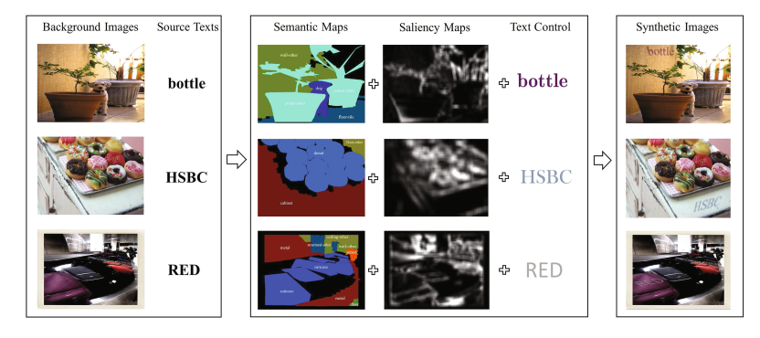
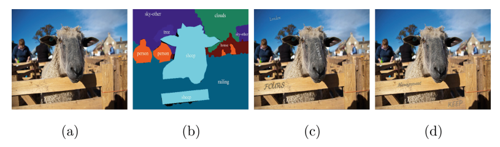
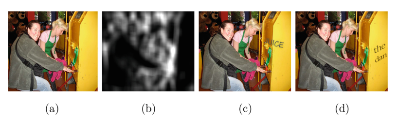
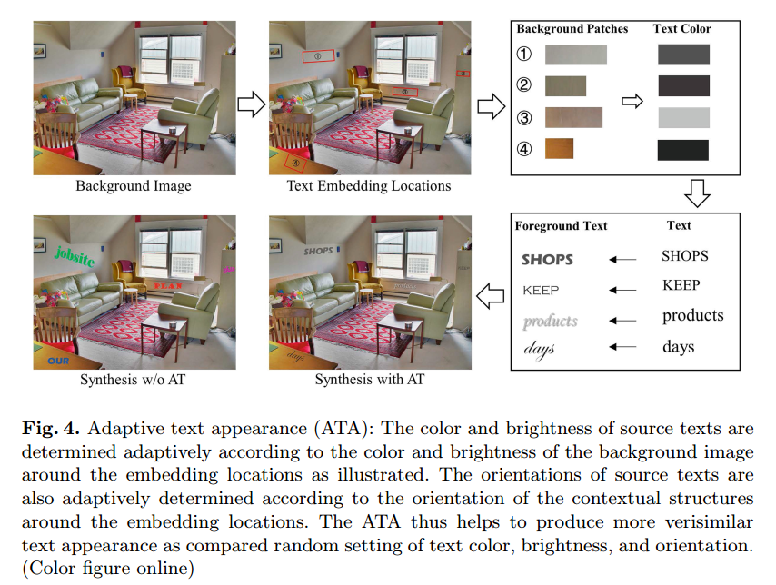

# Verisimilar Image Synthesis for Detection and Recognition of Texts论文阅读

>论文：
>
>发表期刊：ECCV
>
>发表时间：2018
>
>代码：

作者认为合成的数据集能否对训练有效的关键是：让感兴趣的目标（比如文本）以自然的方式嵌入到背景中。

整个合成的流程如下图所示：

给定背景图片和待嵌入的文本，首先预测背景图片的语义分割图（Semantic Map）和显著图（Saliency Maps），根据这两个特征图确定背景图片中合理的嵌入位置（语义上合理，比如文字不应该出现在动物身上）；然后，根据嵌入位置区域的颜色、亮度和上下文结构确定待渲染的文本的颜色、亮度和方向，最后将文本和背景图片融合，得到右边合成的结果。

### 1. 语义一致

语义一致（Semantic Coherence）指的是：文本应该嵌入到背景图片中语义上合理的位置。如下图c，d所示，文本嵌入在栅栏上是符合语义的，但文本不可能出现在天空和马上的。

这部分作者是通过语义分割来实现的。具体来说：作者利用语义分割公共数据集训练了分割模型，同时手动区分了那些类别嵌入文字是合理的，那些是不合理的。当给定一张背景图片时，利用分割模型预测语义分割的结果，得到分割的区域，根据区域的类别就可以决定那些区域可以嵌入文本。

### 2. 显著性指导

对于语义上合理的区域，也不是每个位置都可以嵌入文本。如下图所示，显然文本嵌入到黄色机器的某一个面会比横跨两个面更合理。

因此，对语义上合理的区域还需要进一步的确定文本嵌入的位置。

作者考虑到现实中，文本一般印刷在颜色、纹理比较一致的区域（同特性区域），所以作者利用视觉显著图来辅助确定合适的嵌入位置。如果图片区域越杂乱，显著性越大；而同特性区域的显著性越小，因此，文本应该嵌入到显著性越低的区域。

显著性检测有很多方法，作者采用`Robust and efficient saliency modeling from image co-occurrence histograms`这篇论文中的方法。给定一张图片，显著性模型计算图片对应的显著图，对显著图进行阈值处理得到显著性较低的区域。

### 3. 自适应文本外观

待嵌入的文本的颜色和亮度是根据嵌入区域的颜色好和亮度决定的。具体的过程如下：

（1）从ICDAR2013数据集中学习：计算裁剪的小区域的HoG特征$H_b$，同时在Lab色彩空间中，计算文本颜色和亮度的均值和标准差$(\mu_L, \sigma_L)，(\mu_a, \sigma_a)，(\mu_b, \sigma_b)$，组成（HoG特征，文本颜色）对；

（2）计算嵌入区域的HoG特征$H_s$，根据$H_s$和$H_b$的距离，得到嵌入文本的颜色均值和标准差，根据均值和标准差随机得到文本颜色；

文本的方向可以根据图片的梯度得到。

