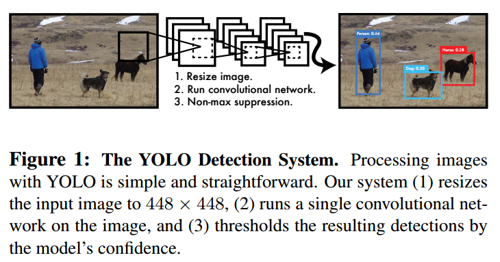
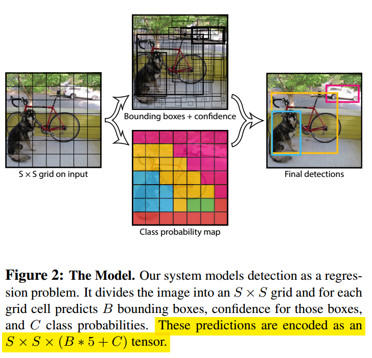
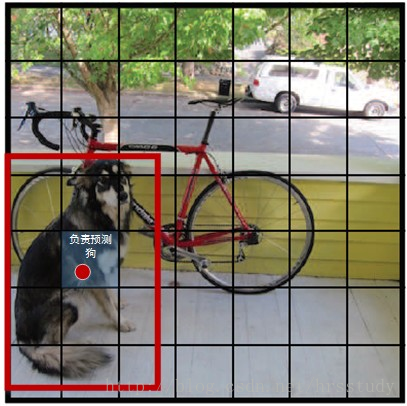
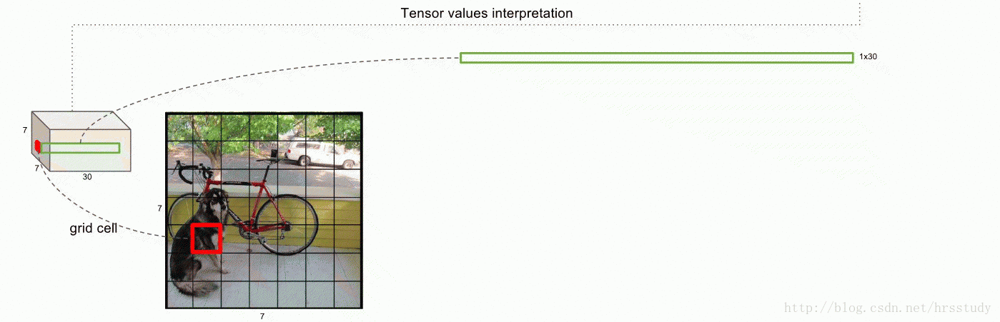
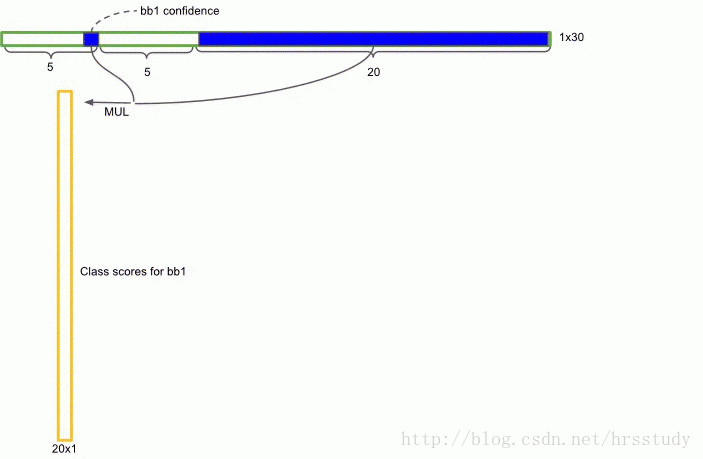
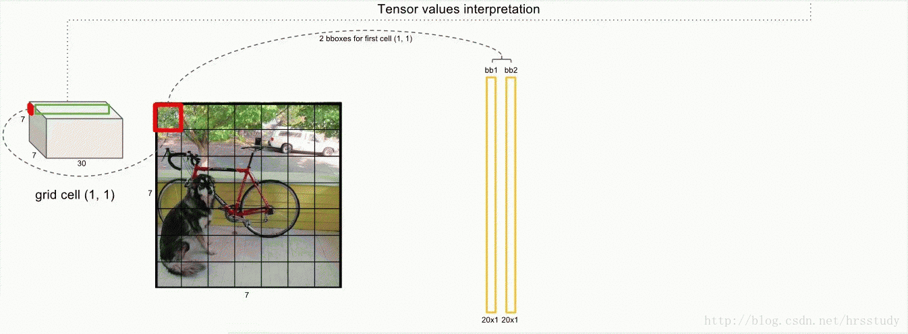
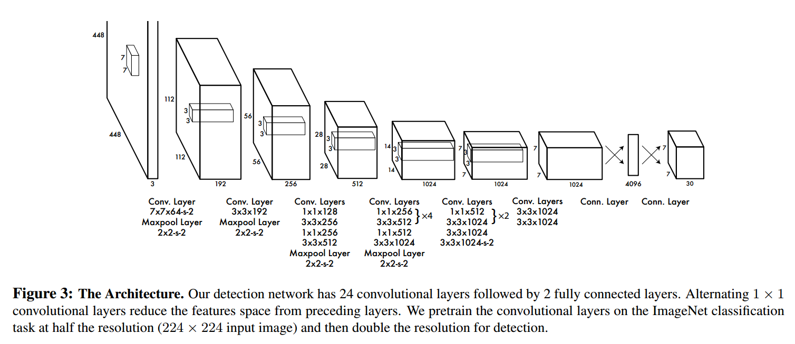
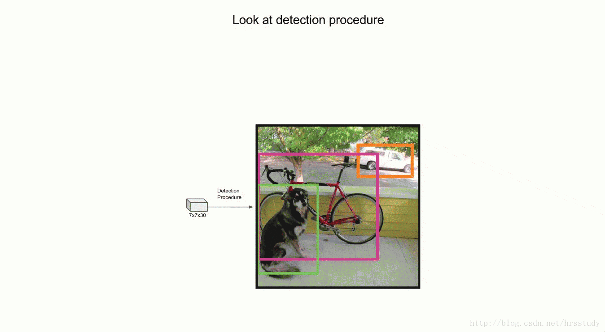
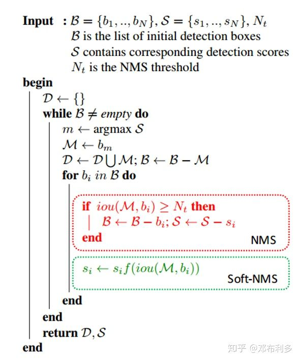

# YOLO论文阅读笔记

> 论文：You Only Look Once: Unified, Real-Time Object Detection
>
> 发表期刊：
>
> 发表时间：

### 1.摘要

* 将目标检测看作是对bounding boxes和类别概率的回归问题

* 整个检测过程使用一个网络，可以端到端的训练
* 检测速度快。YOLO网络可以达到45帧的速度，而Fast YOLO的速度可以达到155帧，但mAP值仍为其他实时检测算法的两倍



### 2.优缺点

**优点**

* 速度快

* 检测时考虑了整张图片

  不同于滑动窗口和候选框方法，YOLO检测时“看”到了整张图片，检测时考虑到了物体的上下文信息

* YOLO学习到了物体的通用表示

  当在自然图片中训练后，直接在艺术作品中测试，效果好于其他算法。作者的理由是在实际应用中很难保证测试的图片与训练图片保持同一分布。

**缺点**

* 精度不高

### 3. 网络模型



YOLO将输入图像划分为$S\times S$的栅格，每个栅格负责检测中心落在该栅格中的物体,如下图所示：



每个栅格预测$B$个bounding boxes和这些bounding boxes对应的confidence scores。

confidence scores表示该模型对于box的预测：该box包含物体的概率和box的坐标有多准。confidence定义为$Pr(Object)*IOU^{truth}_{pred}$，如果该单元格不包含物体，则confidence的值为0，否则让confidence等于predicted bounding box 与ground truth box的IOU。

每个边界框包含5个预测：$x,y,w,h, confidence$。其中，$(x,y)$代表预测的bounding box中心与栅格边界的相对值，高度和宽度为相对于整张图的高和宽的比例，confidence表示预测的bounding box与ground truth box的IOU值。



每个栅格同时预测$C$个类条件概率$Pr(Class_i|Object)$。表示栅格在包含Object时，该Object为类别$i$的概率。且只为每个栅格预测一组类条件概率。

**注意**

类条件概率是针对每个栅格的，而confidence scores则是针对每个bounding box的。在测试阶段，将box的confidence和类条件概率相乘即可以得到box关于某个类别的物体的confidence:
$$
Pr(Class_i|Object)*Pr(Object)*IOU^{turth}_{pred}=Pr(Class_i)*IOU^{truth}_{pred}
$$
该confidence同时反应了box包含该类物体的概率和预测框位置的准确性。



在PASCAL VOC数据集中，作者使用$S=7,B=2$，类别数为$C=20$,所以最后的输入张量为：$7\times 7\times 30$（即$S\times S\times(B*5+C)$）。



### 4.网络结构



网络结构代码：

```python
def build_network(self,
                      images,
                      num_outputs,
                      alpha,
                      keep_prob=0.5,
                      is_training=True,
                      scope='yolo'):
        with tf.variable_scope(scope):
            with slim.arg_scope(
                [slim.conv2d, slim.fully_connected],
                activation_fn=leaky_relu(alpha),
                weights_regularizer=slim.l2_regularizer(0.0005),
                weights_initializer=tf.truncated_normal_initializer(0.0, 0.01)
            ):
                #输入图片大小为448*448,上下左右各padding 3,则图片大小为454*454(448+6)
                net = tf.pad(
                    images, np.array([[0, 0], [3, 3], [3, 3], [0, 0]]),
                    name='pad_1') #手动对输入图片进行padding，四个维度：batch_size,width,height,channel
                #根据VALID卷积操作，输出大小为(454-7+1)/2=224 公式：ceil((input-k_size+1)/strip)
                net = slim.conv2d(
                    net, 64, 7, 2, padding='VALID', scope='conv_2')
                #再pooling,输出大小为224/2=112
                net = slim.max_pool2d(net, 2, padding='SAME', scope='pool_3')
                net = slim.conv2d(net, 192, 3, scope='conv_4')
                net = slim.max_pool2d(net, 2, padding='SAME', scope='pool_5')
                net = slim.conv2d(net, 128, 1, scope='conv_6')
                net = slim.conv2d(net, 256, 3, scope='conv_7')
                net = slim.conv2d(net, 256, 1, scope='conv_8')
                net = slim.conv2d(net, 512, 3, scope='conv_9')
                net = slim.max_pool2d(net, 2, padding='SAME', scope='pool_10')
                net = slim.conv2d(net, 256, 1, scope='conv_11')
                net = slim.conv2d(net, 512, 3, scope='conv_12')
                net = slim.conv2d(net, 256, 1, scope='conv_13')
                net = slim.conv2d(net, 512, 3, scope='conv_14')
                net = slim.conv2d(net, 256, 1, scope='conv_15')
                net = slim.conv2d(net, 512, 3, scope='conv_16')
                net = slim.conv2d(net, 256, 1, scope='conv_17')
                net = slim.conv2d(net, 512, 3, scope='conv_18')
                net = slim.conv2d(net, 512, 1, scope='conv_19')
                net = slim.conv2d(net, 1024, 3, scope='conv_20')
                net = slim.max_pool2d(net, 2, padding='SAME', scope='pool_21')
                net = slim.conv2d(net, 512, 1, scope='conv_22')
                net = slim.conv2d(net, 1024, 3, scope='conv_23')
                net = slim.conv2d(net, 512, 1, scope='conv_24')
                net = slim.conv2d(net, 1024, 3, scope='conv_25')
                net = slim.conv2d(net, 1024, 3, scope='conv_26')
                net = tf.pad(
                    net, np.array([[0, 0], [1, 1], [1, 1], [0, 0]]),
                    name='pad_27')
                net = slim.conv2d(
                    net, 1024, 3, 2, padding='VALID', scope='conv_28')
                net = slim.conv2d(net, 1024, 3, scope='conv_29')
                net = slim.conv2d(net, 1024, 3, scope='conv_30')
                net = tf.transpose(net, [0, 3, 1, 2], name='trans_31')
                net = slim.flatten(net, scope='flat_32')
                net = slim.fully_connected(net, 512, scope='fc_33')
                net = slim.fully_connected(net, 4096, scope='fc_34')
                net = slim.dropout(
                    net, keep_prob=keep_prob, is_training=is_training,
                    scope='dropout_35')
                net = slim.fully_connected(
                    net, num_outputs, activation_fn=None, scope='fc_36')
        return net
```

### 5.损失函数


### 6.非极大值抑制(NMS)

* 目的

从一堆检测框中去除冗余的检测框，保留最好的一个。

* 方法

对于Bounding Box的列表B及其对应的置信度S，采用下面的计算方式：选择具有最大score的检测框M，将其从B集合中移除并加入到最终的检测结果D中。通常将B中剩余检测框中与M的IOU大于阈值Nt的框从B中移除。重复这个过程，直到B为空。
常用的阈值是 `0.3 ~ 0.5`。

常用的排序方式有：1）按计算的得分或概率排序 2）按右下角的坐标排序 3）按面积排序



* 缺点

当两个物体大部分重叠时，由于检测框的IOU较大，容易超过NMS的阈值而被去除，造成检测遗漏。

### 7.Soft NMS

为了解决以上问题，有人提出了soft nms算法。



在nms算法中：
$$
s_i=\left\{
\begin{aligned}
s_i&&IOU(M,b_i)<N_i \\
0&&IOU(M,b_i)>N_i 
\end{aligned}
\right.
$$


在soft nms算法中，对重叠的检测框的S乘以一个衰减的权重，重叠区域越大权重越小，即S衰减越大：
$$
s_i=s_i*e^{\frac{-IOU(M, b_i)^2}{\sigma}}
$$

* 实现

```python
def nms(bboxes, iou_threshold, sigma=0.3, method='nms'):
    """
    implementation of NMS and Soft NMS
    :param bboxes: (xmin, ymin, xmax, ymax, score, class)

    Note: soft-nms, https://arxiv.org/pdf/1704.04503.pdf
    https://github.com/bharatsingh430/soft-nms
    """
    classes_in_img = list(set(bboxes[:, 5]))
    best_bboxes = []

    for cls in classes_in_img:
        cls_mask = (bboxes[:, 5] == cls)
        cls_bboxes = bboxes[cls_mask]

        while len(cls_bboxes) > 0:
            max_ind = np.argmax(cls_bboxes[:, 4])
            best_bbox = cls_bboxes[max_ind]
            best_bboxes.append(best_bbox)
            cls_bboxes = np.concatenate([cls_bboxes[: max_ind], cls_bboxes[max_ind + 1:]])
            iou = bboxes_iou(best_bbox[np.newaxis, :4], cls_bboxes[:, :4])
            weight = np.ones((len(iou),), dtype=np.float32)

            assert method in ['nms', 'soft-nms']

            if method == 'nms':
                iou_mask = iou > iou_threshold
                weight[iou_mask] = 0.0

            if method == 'soft-nms':
                weight = np.exp(-(1.0 * iou ** 2 / sigma))

            cls_bboxes[:, 4] = cls_bboxes[:, 4] * weight
            score_mask = cls_bboxes[:, 4] > 0.
            cls_bboxes = cls_bboxes[score_mask]

    return best_bboxes

def bboxes_iou(boxes1, boxes2):

    boxes1 = np.array(boxes1)
    boxes2 = np.array(boxes2)

    boxes1_area = (boxes1[..., 2] - boxes1[..., 0]) * (boxes1[..., 3] - boxes1[..., 1])
    boxes2_area = (boxes2[..., 2] - boxes2[..., 0]) * (boxes2[..., 3] - boxes2[..., 1])

    left_up       = np.maximum(boxes1[..., :2], boxes2[..., :2])
    right_down    = np.minimum(boxes1[..., 2:], boxes2[..., 2:])

    inter_section = np.maximum(right_down - left_up, 0.0)
    inter_area    = inter_section[..., 0] * inter_section[..., 1]
    union_area    = boxes1_area + boxes2_area - inter_area
    ious          = np.maximum(1.0 * inter_area / union_area, np.finfo(np.float32).eps)

    return ious
```


参考：[深入理解目标检测与YOLO（从v1到v3）](https://blog.csdn.net/qq_39521554/article/details/80694512)