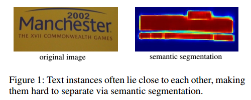
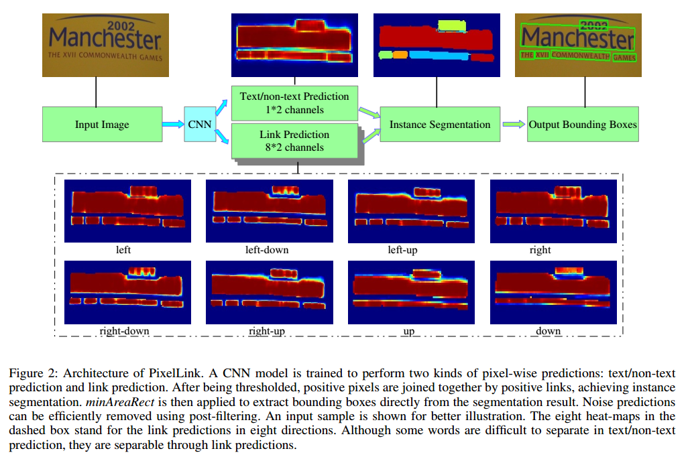
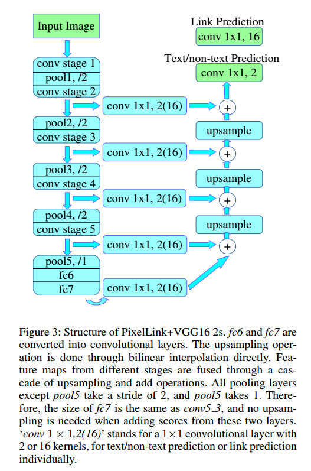

# PixelLink阅读笔记

> 论文：PixelLink: Detecting Scene Text via Instance Segmentation
>
> 发表期刊：AAAI
>
> 发表时间：2018

### 1.概述

PixelLink是基于实例分割（instance segmentation）的，首先对每个像素点进行文本／非文本的预测（text/no-text prediction）和八个方向的连接预测（link prediction），对是文本的像素点（positive pixel）根据连接预测的情况进行组合CC（Connected Components），达到文本实例分割的结果。最后，直接从CC中利用OpenCV中的minAreaRect方法得到每个文本实例的边界框（bounding boxes），而不需要位置回归。

### 2.为什么不使用语义分割

如图为语义分割的结果。可以看到，由于文本之间靠得比较近，在语义分割的分割结果中很难将每一个文本实例区分开。

### 3. PixelLink模型

框架如图所示

#### 3.1  网络结构
主体结构采用的是VGG16，将`fc6` `fc7`替换成了卷积层，并且采用了特征融合（应该是类似于FCN的结构）。网络结构如图所示。

网络的输出有两部分，一部分为文本/非文本预测，一部分为连接预测，输出分别为`1*2=2`通道和`8*2=16`通道。
特征融合采用的跳跃连接结构有两种，分别是**PixelLink+VGG16 2s**，对应结构为`{conv2_2, conv3_3, conv4_3, conv5_3, fc_7}`,输出的结果大小为原图的一半， **PixelLink+VGG16 4s**对应的结构为`{conv3_3, conv_4_3, conv_5_3, fc_7}`，输出的结果大小为原图的1/4。

#### 3.2 如何连接像素
对文本/非文本预测和连接预测分别设定阈值，大于阈值的为Positive，文本/非文本预测为Positive的像素为Positive pixel，连接预测为Positive的为Positive link，预测结果为Negative的类似。对Positive pixel进行连接操作，原则是如果两个Positive pixel之间的连接中有一个或两个都是Positive link就将这两个像素连接。对所有Positive pixel进行连接得到CC或实例分割结果。
#### 3.3 提取边界框
使用OpenCV中的minAreaRect方法，输出为旋转的矩形。因此，PixelLink可以检测任意方向的文本。
这是PixelLink与基于回归的方法的主要不同点。

#### 3.4 后处理
根据检测框的几何特征进行过滤处理，主要是排除一些较小的、非文本的边界框。
* 具体做法
设置边界框最短边的最小值和面积最小值，小于该值的直接去除。如IC15中使用的最短边的最小值为10像素，面积最小为300像素。
* 最小值的设定
根据训练集中99％的文本框进行设置，即保证训练集中99%的文本框都满足这个标准。

### 4. 优化
#### 4.1 Groud Truth处理
当像素在GT的文本框中时，该像素为Postitive pixel，重叠的像素不考虑。给定一个像素，如果其中某一个方向的连接像素也属于同一文本框，则该连接为Positive link，其余为Negative。注意，Ground Truth的计算是在将输入图片调整为输出大小后计算的，在**2s**中，调整为`conv2_2`的大小，在**4s**中调整为`conv3_3`的大小。
#### 4.2 损失函数
损失函数由文本/非文本预测损失（像素损失）和连接损失两部分组成：

$$
L = \lambda L_{pixel} + L_{link}
$$
连接损失中对Positive pixel计算。作者将$\lambda$的值设为2.0。**为什么？？**

>Since L_link is calculated on positive pixels only, the classification task of pixel is more >important than that of link, and λ is set to 2.0 in all experiments.
* 像素损失
  作者考虑到每个文本实例应该具有一样的重要性，设计了一种**Instance-Balanced Cross-Entropy**，使用小文本中的像素具有较大权重，大文本中的像素权重较小，同时保证了所有文本实例的权重是一样的。
  假设图片中有$N$个文本实例，每个文本实例的权重用$B_i$表示，且第$i$个实例的面积为$area=S_i$，则实例中每个像素的权重为$w_i=\frac {B_i}{S_i}$

$$
B_i = \frac {S}{N}, S = \sum^N_i{S_i}, i \in {{1,\c_dots,N}}
$$
$S$表示所有文本像素点。计算像素损失时，负样本只选择$r*S$个损失值最大的进行计算，且$r=3$
根据上面的公式就可以得到所有像素的权重矩阵$W$，最终的像素损失为：
$$
L_{pixel} = \frac {1}{(1+r)S}WL_{pixel_CE}
$$
其中，$L_{pixel_CE}$为文本/非文本预测的交叉熵损失矩阵。
* 连接损失

