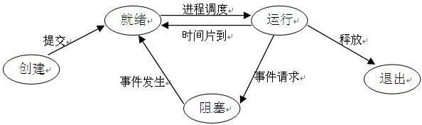

# 进程和线程

区别

1）进程是资源分配的最小单位，线程是调度的最小单位；

2）每个进程拥有独立的内存空间，因此创建进程、切换进程开销大；而属于一个进程的所有线程共用进程的资源，创建线程和进行线程之间的切换的开销较小；

3）进程之间是独立的，导致进程间通信困难；而线程之间通信比较容易；

进程的状态转换

孤儿进程、僵尸进程、守护进程

孤儿进程：一个父进程先结束了，则子进程就变成了孤儿进程。孤儿进程会自动向上被init进程收养，由init进程完成子进程的资源回收工作；

僵尸进程：当一个子进程结束了，但它的父进程还没有调用wait或waitpid来进行子进程的资源回收，则该子进程称为僵尸进程；

守护进程：脱离终端在后台运行的进程，进程的输出信息不会打印到终端，也不会被终端发出的信息打断；